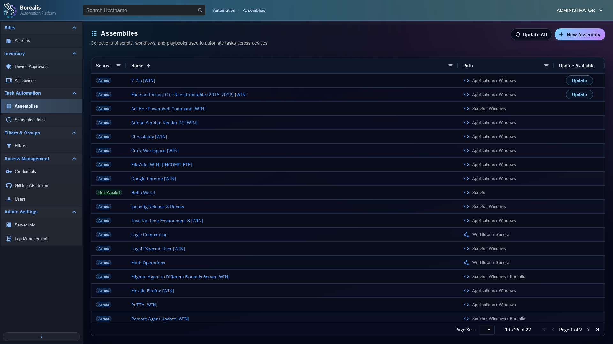
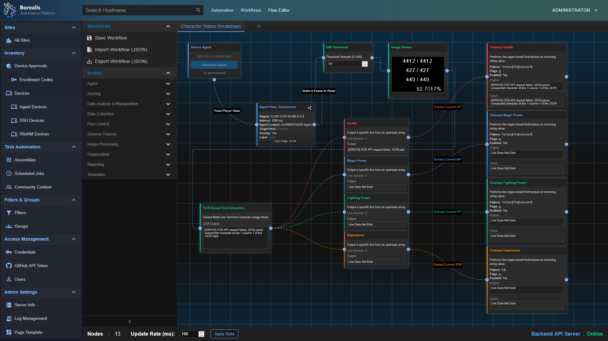
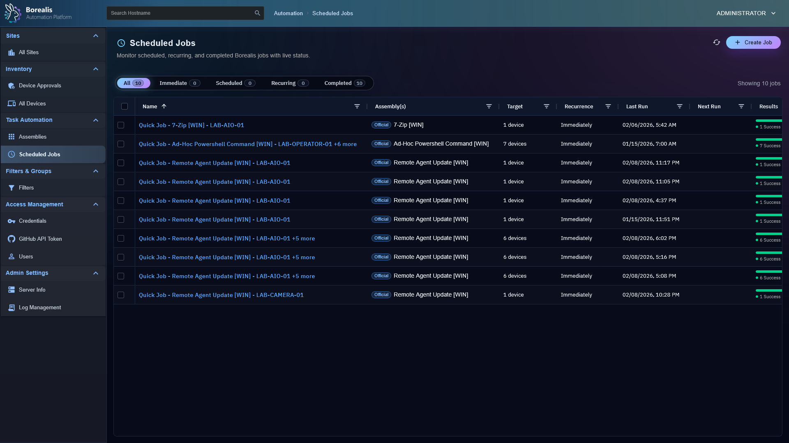

# Automation and Execution

Use this section for script assemblies, visual workflows, scheduled jobs, SSH/WinRM execution, Ansible playbooks, and watchdog remediation.

  <figure class="bo-screenshot">
    
    <figcaption>Assemblies store reusable scripts, playbooks, and workflows.</figcaption>
  </figure>
  <figure class="bo-screenshot">
    
    <figcaption>Workflow Editor composes automation with visual nodes and typed connections.</figcaption>
  </figure>
  <figure class="bo-screenshot">
    
    <figcaption>Scheduled jobs bind assemblies to targets, schedules, and execution contexts.</figcaption>
  </figure>

## Guides

- [Assemblies and Quick Jobs](assemblies.md) - assembly storage, authoring JSON, quick jobs, and remediation execution.
- [Flow Editor and Nodes](flow-editor-and-nodes.md) - workflow UI, node registration, ports, and runtime conventions.
- [Scheduled Jobs](scheduled-jobs.md) - schedule types, target resolution, history, and onboarding jobs.
- [SSH Connection Logic](SSH_Connection_Logic.md) - Ansible SSH bootstrap, credential handling, and transport rules.
- [Watchdogs](watchdogs.md) - incident detection, suppressions, assignments, and remediation.
