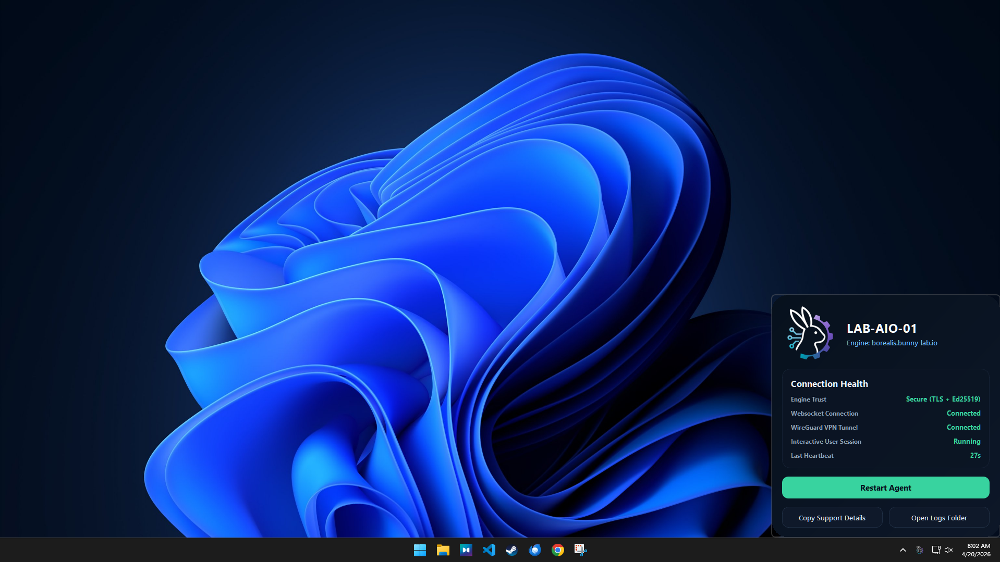

# Core Runtimes

Use this section when changing Engine, Agent, service layout, packaging, or startup behavior.

  <figure class="bo-screenshot">
    
    <figcaption>Engine service status and operational health surface through Server Overview.</figcaption>
  </figure>
  <figure class="bo-screenshot">
    
    <figcaption>Agent local UI reflects device-side runtime state for end users and support staff.</figcaption>
  </figure>

## Guides

- [Engine Runtime](engine-runtime.md) - API backend, WebUI, sockets, scheduler, VPN, logs, and runtime paths.
- [Agent Runtime](agent-runtime.md) - Go Agent roles, settings, storage, identity, and update behavior.
- [Docker Stack Breakdown](Stack_Breakdown.md) - container inventory, service ownership, ports, volumes, and operational layout.
