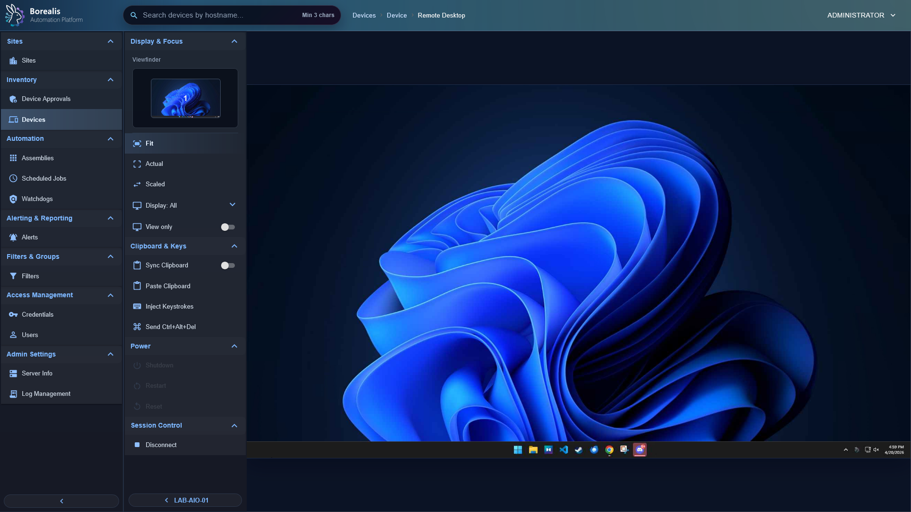

# Operations and Remote Access

Use this section for daily fleet operations: inventory, device details, alerts, logs, remote shell, remote desktop, and WireGuard transport.

  <figure class="bo-screenshot">
    
    <figcaption>Device Summary centralizes inventory, role health, actions, and remote workflows.</figcaption>
  </figure>
  <figure class="bo-screenshot">
    
    <figcaption>Remote Desktop rides through the managed WireGuard path and browser VNC bridge.</figcaption>
  </figure>
  <figure class="bo-screenshot">
    
    <figcaption>Alert queues track incidents produced by watchdogs and device telemetry.</figcaption>
  </figure>

## Guides

- [Device Management](device-management.md) - inventory, sites, filters, metadata, approvals, onboarding, and purge.
- [Device Alerts](device-alerts.md) - incident queue, acknowledgement, suppression, and alert lifecycle.
- [VPN and Remote Access](vpn-and-remote-access.md) - WireGuard, Remote PowerShell, VNC, and public edge expectations.
- [Logging and Operations](logging-and-operations.md) - logs, retention, operational health, and recovery checks.
