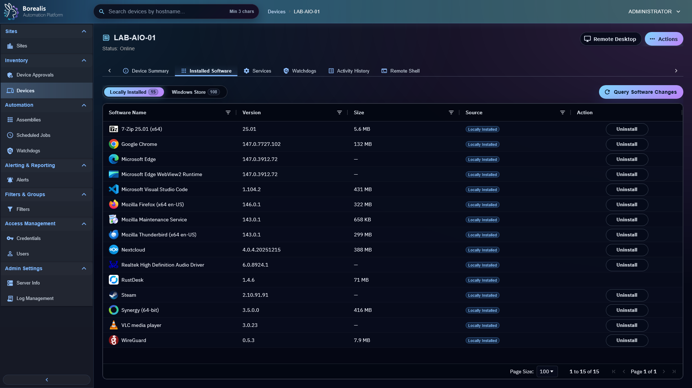

# Software Uninstall Blocklist

## Purpose
Explain how to block installed software whose registry-provided `QuietUninstallString` still prompts, hangs, or otherwise cannot be trusted for unattended Borealis uninstall.

## Visual Context

<figure class="bo-screenshot">
  
  <figcaption>Blocklist rules protect operators from unsafe unattended uninstall actions.</figcaption>
</figure>

## Blocklist File
- Path: `Data/Engine/Containers/api-backend/data/services/API/devices/software_uninstall_blocklist.json`
- Runtime consumer: `Data/Engine/Containers/api-backend/data/services/API/devices/software_uninstall.py`

## JSON Shape
```json
{
  "windows_quiet_uninstall_blocklist": [
    {
      "rule_id": "fedora_media_writer_quiet_string_interactive",
      "source": "local_installed",
      "publisher_contains_any": ["fedora project"],
      "name_contains_any": ["fedora media writer"],
      "exe_names": ["uninstall.exe"],
      "quiet_args_any": ["/s"],
      "reason": "Fedora Media Writer's registered QuietUninstallString still prompts for confirmation."
    }
  ]
}
```

## Supported Match Fields
- `source`
  Exact normalized Borealis source such as `local_installed`.
- `publisher_contains_any`
  Optional substring list matched against the publisher.
- `name_contains_any`
  Optional substring list matched against the software name.
- `exe_names`
  Optional executable-name list matched against the parsed `QuietUninstallString`.
- `quiet_args_any`
  Optional switch list that must appear in the parsed quiet command arguments.

## Required Outcome Field
- `reason`
  Operator-facing explanation returned by Borealis when uninstall is blocked.

## When To Use The Blocklist
- The software claims to have a `QuietUninstallString`, but manual testing still shows prompts.
- The vendor installer ignores or misinterprets its quiet switches.
- Borealis should refuse automation until a verified override command is known.

## Operator Hotload Workflow
1. Open the device `Installed Software` tab.
2. Right-click the software name.
3. Click `Block Uninstallation`.
4. Enter the reason other operators should see when Borealis refuses the uninstall.
5. Save the block.
6. Borealis writes the rule into `software_uninstall_blocklist.json` and hotloads it immediately.
7. When the software later has a verified unattended uninstall path, either create a global uninstall override or right-click the row and choose `Unblock Uninstallation`.
8. Commit `software_uninstall_blocklist.json` to Git later when the block should survive Engine image rebuilds and become an official shipped rule.

## Manual File Workflow
1. Open `software_uninstall_blocklist.json`.
2. Add or update a rule under `windows_quiet_uninstall_blocklist`.
3. Save the file.
4. Re-open the device details or retry the uninstall path; Borealis hotloads the file on the next uninstall-capability resolution.
5. Commit `software_uninstall_blocklist.json` to Git when the block must survive Engine image rebuilds.

## Example
```json
{
  "windows_quiet_uninstall_blocklist": [
    {
      "rule_id": "vendor_app_quiet_string_prompts",
      "source": "local_installed",
      "name_contains_any": ["Vendor App"],
      "publisher_contains_any": ["Vendor Inc"],
      "exe_names": ["uninstall.exe"],
      "quiet_args_any": ["/s"],
      "reason": "Vendor App's registered QuietUninstallString still opens an interactive confirmation prompt."
    }
  ]
}
```

## Related Documentation
- [Device Management](../Operations%20and%20Remote%20Access/device-management.md)
- [API Reference](../Data%20and%20Schema/api-reference.md)
- [Adding Software to Uninstall Overrides](adding-software-to-uninstall-overrides.md)
- [Adding Software to Icon Overrides](adding-software-to-icon-overrides.md)

??? example "Detailed Codex Breakdown"

    ### How to decide between blocklist vs override
    - Use the blocklist when the existing quiet metadata is unsafe and no verified unattended replacement command is available yet.
    - Use `software_uninstall_overrides.json` instead when a tested custom command is already known.
    - Uninstall overrides are checked before the blocklist, so a verified override can intentionally replace an otherwise blocked registry quiet string.

    ### Codex workflow
    - Prefer the operator-created hotloaded rule in `software_uninstall_blocklist.json` as the source of truth when asked to make a block official.
    - If the operator has not created the rule yet, gather the current software row data from `GET /api/device/details/<hostname>` plus the observed failure mode from the operator.
    - Keep the reason explicit so other operators understand whether the problem is a prompt, a hang, a misleading silent flag, or another unsafe behavior.

    ### Implementation reference
    - Engine resolver: `Data/Engine/Containers/api-backend/data/services/API/devices/software_uninstall.py`
    - Blocklist data file: `Data/Engine/Containers/api-backend/data/services/API/devices/software_uninstall_blocklist.json`
