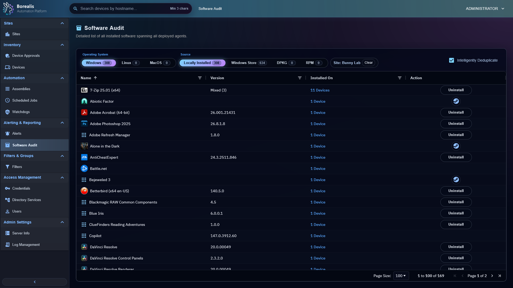

# Software Management

Use this section for installed software inventory and operator-controlled uninstall behavior.

  <figure class="bo-screenshot">
    
    <figcaption>Installed software inventory shows device package state and per-app actions.</figcaption>
  </figure>
  <figure class="bo-screenshot">
    
    <figcaption>Software audit views help operators compare fleet software state.</figcaption>
  </figure>

## Guides

- [Software Icon Overrides](adding-software-to-icon-overrides.md) - map software names to preferred icons.
- [Software Uninstall Blocklist](adding-software-to-uninstall-blocklist.md) - prevent unsafe or unsupported uninstall actions.
- [Software Uninstall Overrides](adding-software-to-uninstall-overrides.md) - define custom uninstall commands.
