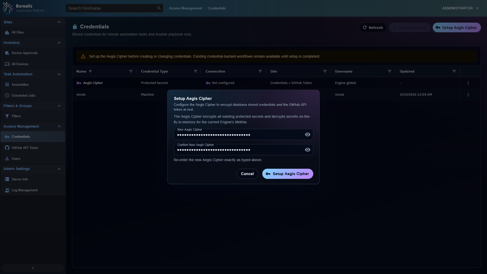

# Start Here

Use this section for first contact with Borealis: install flow, architecture, security posture, UI conventions, and test entrypoints.

  <figure class="bo-screenshot">
    
    <figcaption>Device list is the normal operator entrypoint after Engine bootstrap.</figcaption>
  </figure>
  <figure class="bo-screenshot">
    
    <figcaption>Aegis, token handling, and enrollment trust live in the security docs.</figcaption>
  </figure>

## Guides

- [Getting Started](getting-started.md) - bootstrap Engine, install Agent, and complete first-run checks.
- [Architecture Overview](architecture-overview.md) - high-level system map across Engine, Agent, PostgreSQL, sockets, and WebUI.
- [Security and Trust](security-and-trust.md) - enrollment, Aegis, token protection, and code-signing behavior.
- [UI and Notifications](ui-and-notifications.md) - WebUI design rules, route patterns, AG Grid behavior, toasts, and page chrome.
- [Unit Testing](Unit_Testing.md) - unit test commands and domain flags.
- [Testing](testing.md) - short test entrypoint.
- [Testing Regressions](testing-regressions.md) - tracked regression baseline.
