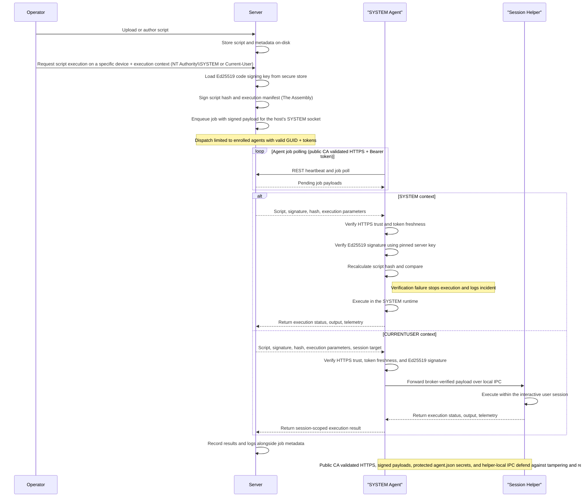

# Security and Trust

## Purpose
Explain the Borealis trust model, enrollment security, token handling, and code signing behavior.

## Security Model Summary
- Mutual trust: each agent has a unique Ed25519 identity key; the Engine issues Ed25519-signed access tokens bound to that fingerprint.
- Public CA trust: Borealis exposes the Engine through a Borealis-managed Traefik edge that uses Let's Encrypt certificates for browser and agent HTTPS traffic.
- Short-lived access tokens: JWTs signed with Ed25519, default lifetime about 15 minutes.
- Long-lived refresh tokens: 90-day sliding window, hashed in the Engine database.
- Operator session signing secret: generated once and persisted at `Engine/Services/api-backend/secrets/engine_secret.txt`.
- Front-door operator bootstrap: Borealis now requires the Aegis Cipher before it will render any login UI after first setup or restart.
- Operator sign-in methods: Borealis supports password plus TOTP MFA, and WebAuthn passkeys for direct browser sign-in once the Engine reaches the `login_required` bootstrap phase.
- Operator auth secrets at rest: Aegis now protects stored password hashes, TOTP secrets, passkey cryptographic material, directory bind passwords/keytabs, reusable credentials, and the GitHub API token.
- Code signing: scripts are signed by the Engine; agents reject payloads with invalid signatures.
- On supported Windows deployments, only the SYSTEM Borealis runtime authenticates to the Engine; per-session helpers are local-only and inherit no Borealis token or socket identity.

## Security Breakdown (Full)
### Overall
- Borealis enforces mutual trust: each agent presents a unique Ed25519 identity to the server, and the server issues EdDSA-signed (Ed25519) access tokens bound to that fingerprint.
- Public HTTPS terminates at the Borealis-managed Traefik edge on the engine host. Let's Encrypt owns the browser/agent trust chain, while the Python Engine stays on loopback HTTP behind Traefik.
- Operators no longer need to download or install a Borealis private root CA for normal browser access.
- Device enrollment is gated by enrollment and installer codes (configurable expiration and usage limits) and an operator approval queue; replay-resistant nonces plus rate limits (40 req/min/IP, 12 req/min/fingerprint) prevent brute force or code reuse.
- Supported Windows agent traffic is owned by the SYSTEM runtime; per-session helpers never call device APIs or open their own Engine socket. Missing, expired, mismatched, or revoked credentials are rejected before any business logic runs. Operator-driven revoking and device quarantining are not yet implemented.
- Replay and credential theft defenses layer in DPoP proof validation (thumbprint binding) on the server side and short-lived access tokens (about 15 minutes) with 90-day refresh tokens hashed via SHA-256.
- Centralized logging under `Engine/Services/api-backend/logs` and `Agent/Logs` captures enrollment approvals, rate-limit hits, signature failures, and auth anomalies for post-incident review. Recent wrong-code enrollment attempts are also surfaced in the Device Approval Queue.
- Operator-facing API endpoints (device inventory, assemblies, job history, credentials, user management, etc.) require the Engine to be Aegis-unlocked and in the `login_required` bootstrap phase before an authenticated operator session or bearer token is honored.
- Directory authentication supports LDAP/LDAPS user-bind providers and Active Directory Kerberos password verification. LDAPS providers can use system trust, uploaded CA PEM, or an operator-reviewed pinned peer certificate downloaded from the LDAP server. Provider-scoped host overrides let Borealis connect to a configured IP while keeping FQDN SNI and certificate validation intact. Directory users are cached just-in-time in `users`, keep Borealis TOTP MFA, and cannot register Borealis passkeys.
- Active sessions are revalidated against the operator row on authenticated requests. Deleted users, disabled directory cache entries, and deprovisioned directory users stop passing authorization checks without waiting for token expiry.
- Borealis operator accounts still support username/password plus TOTP and direct passkey sign-in, but those flows are now unreachable until Aegis setup or unlock is complete.

### Operator Bootstrap and At-Rest Auth Protection
- First deployment now follows `Set Aegis Cipher -> Create first administrator -> Complete MFA -> Enter normal Borealis`.
- Every later Engine restart follows `Unlock Aegis Cipher -> Enter normal Borealis login or passkey flow`.
- Aegis setup and unlock moved to public bootstrap endpoints under `/api/bootstrap/*`; the normal authenticated Aegis page actions are now rotation and force reset only.
- Force reset is the disaster-recovery path when the old cipher is gone: Borealis destroys stored operator auth secrets, reusable credential secrets, and the GitHub token, then requires a fresh Aegis setup plus administrator account recovery before operators can use the Engine again.
- Usernames, display names, roles, site assignments, passkey labels, and other non-secret operator metadata stay plaintext so Borealis can still identify recovery targets and render admin-facing status once the Engine is recovered.

### Server Security
- Manages the public HTTPS edge: Borealis renders Traefik and Let's Encrypt runtime state under `Engine/Services/traefik-edge/state/` and `Engine/Services/traefik-edge/config/`, while internal engine-only material such as WireGuard and code-signing keys stays under `Engine/Services/api-backend/secrets/Certificates/`.
- Script delivery is code-signed with an Ed25519 key stored under `Engine/Services/api-backend/secrets/Certificates/Code-Signing`; agents refuse any payload whose signature does not match the pinned public key.
- Device authentication checks GUID normalization, SSL fingerprint matches, token version counters, and quarantine flags before admitting requests; missing rows with valid tokens auto-recover into placeholder records to avoid accidental lockouts.
- Refresh tokens are never stored in cleartext; only SHA-256 hashes plus DPoP bindings are stored in PostgreSQL, and reuse after revocation/expiry returns explicit error codes.
- Enrollment workflow queues approvals, detects hostname and fingerprint conflicts, offers merge/overwrite options, and records auditor identities so trust decisions are traceable.
- Automatic local-network onboarding never bypasses enrollment approval. It only performs a remote agent install using stored machine or domain credentials; the installed agent must still request approval with the selected site's enrollment code.
- Background pruning of expired enrollment codes and refresh tokens is not wired yet; a maintenance task is still needed.

### Agent
- Generates device-wide Ed25519 key pairs on first launch, storing PKCS8/SPKI base64 material in protected `agent.json` beside `Agent.exe`.
- Stores refresh/access tokens in protected `agent.json` and re-enrolls on authentication failures.
- Uses the system trust store and hostname validation for the public Engine FQDN instead of rotating a pinned public Engine certificate.
- Treats every script payload as hostile until verified: only Ed25519 signatures from the server are accepted, missing or invalid signatures are logged and dropped, and the trusted signing key is updated only after successful verification between the agent and the server.
- Operates outbound-only; there are no listener ports, and every API/WebSocket call flows through the Go auth client, forcing token refresh logic before retrying.
- Logs bootstrap, enrollment, token refresh, and signature events to daily-rotated files under `Agent/Logs`, giving operators visibility without leaking secrets outside the project root.
- The SYSTEM broker can launch per-session helpers for current-user execution, but those helpers do not enroll, do not store tokens, and talk only to the local SYSTEM broker over local IPC.
- Borealis treats direct Session 0 interaction as unsupported; helper launch into `winsta0\\default` is the supported path for user-visible interaction.

### WireGuard Agent to Engine Tunnels
- Borealis started with a bespoke reverse tunnel stack (WebSocket framing + domain lanes); its handshake and security model did not scale, so the project moved to WireGuard as the Engine <-> Agent data pipeline for secure remote protocols and future remote desktop control.
- Persistent, outbound-only: agents ensure the tunnel at boot (no inbound listeners), and it remains online while the agent runs.
- Shared sessions: one live VPN tunnel per agent, reused across operators to avoid redundant connections.
- Fast and robust transport: WireGuard provides encrypted UDP transport with lightweight handshakes that keep latency low and reconnects resilient.
- Orchestration security: the Engine issues short-lived, Ed25519-signed tunnel tokens that the agent verifies before bringing the tunnel up.
- Public CA trust: tunnel orchestration uses the same Let's Encrypt-backed HTTPS control plane as REST and Socket.IO.
- Isolation by default: each agent gets a host-only /32; AllowedIPs are restricted to the agent /32 and the Engine /32; no LAN routes and no client-to-client traffic.
- Port-level controls: the tunnel is trusted end-to-end, and the Engine/Agent firewall rules allow a global port allowlist between the Engine /32 and Agent /32 (defaults to 47002, 5900, and 22, configurable via `BOREALIS_WIREGUARD_PORT_ALLOWLIST`).
- Live PowerShell today: a VPN-only shell endpoint enables remote command execution with SYSTEM-level (`NT AUTHORITY\\SYSTEM`) access for deep diagnostics and remediation.
- Session lifecycle: tunnels stay online with `PersistentKeepalive = 30`; session material includes a virtual IP; role-level disconnects (shell/VNC) leave the tunnel intact.
- Future protocols: reuse the same trusted tunnel for SSH, WinRM, VNC, WebRTC streaming, and other remote management workflows without per-device port toggles.

## Enrollment and Identity
- Enrollment uses install codes and operator approval.
- The agent generates its Ed25519 key pair locally and proves possession via signed nonces.
- Engine returns GUID, access token, refresh token, and script signing key.

## Token and DPoP Handling
- Access tokens are required on device APIs (Bearer token).
- Refresh tokens are stored encrypted on the agent and hashed on the Engine.
- DPoP proof headers bind refresh tokens to a key thumbprint and prevent replay.

## Code Signing
- Engine signs script payloads using `Engine/Services/api-backend/secrets/Certificates/Code-Signing` keys.
- Agent verifies signatures before execution; failures are logged and rejected.

## Automated Agent Enrollment
If you deploy the agent via Group Policy or another automation platform, you can pre-inject an enrollment code during install. The enrollment code below is an example only.

**Windows**:
```powershell
.\Agent.exe --server-url "https://borealis.example.com" --site-enrollment-code "E925-448B-626D-D595-5A0F-FB24-B4D6-6983"
```
**Linux**:
```bash
/opt/Borealis/Agent/Agent --server-url "https://borealis.example.com" --site-enrollment-code "E925-448B-626D-D595-5A0F-FB24-B4D6-6983"
```
Passing an enrollment code writes it into protected `agent.json` before the service starts so the supplied code wins over cached installer codes.

### Automatic Local-Network Enrollment
- Sites > Onboard Devices creates scheduler-backed enrollment jobs for local-network Linux and Windows targets.
- Operators provide a site, device OS, discovery scope, stored machine or domain credential, install branch, and schedule. The selected credential remains in Aegis-protected credential storage.
- Linux enrollment uses SSH. Windows enrollment tries SMB `ADMIN$` plus Remote Service Control Manager, then a remote scheduled task, then WMI/DCOM process creation, then WinRM before requiring manual install. Windows onboarding uses the standard `C:\Borealis` install root plus a host-wide mutex and a non-secret state marker so repeated Engine redeploys do not create parallel installers or duplicate pending approvals.
- Borealis writes only non-secret onboarding correlation (`job_id`, `run_id`, target) to the agent settings during remote install so pending approvals can show their source.
- Manual approval remains the trust boundary. A successful remote install means the agent reached the approval queue, not that the device is trusted.

## Agent/Server Enrollment (Sequence Diagram)
```mermaid
sequenceDiagram
    participant Operator
    participant Server
    participant SYS as "SYSTEM Agent"
    participant HELPER as "Session Helper"

    Operator->>Server: Request installer code
    Server-->>Operator: Deliver hashed installer code
    Note over Operator,Server: Human-controlled code binds enrollment to known device

    SYS->>Server: Initiate TLS session
    Server-->>SYS: Present TLS certificate
    Note over SYS,Server: Public CA validation plus hostname checks stop MITM

    SYS->>SYS: Generate Ed25519 identity key pair
    Note right of SYS: Private key stored in protected agent.json

    SYS->>Server: Enrollment request (installer code, public key, fingerprint)

    Server->>Operator: Prompt for enrollment approval
    Operator-->>Server: Approve device enrollment
    Note over Operator,Server: Manual approval blocks rogue agents

    Server-->>SYS: Send enrollment nonce
    SYS->>Server: Return signed nonce to prove key possession
    Note over Server,Operator: Server verifies signature and records GUID plus key fingerprint

    Server->>SYS: Issue GUID, short-lived token, refresh token, script-signing key
    Note over SYS,Server: Agent stores GUID and tokens in protected agent.json
    Note over Server,Operator: Database keeps refresh token hash, key fingerprint, audit trail

    loop Secure Sessions
        SYS->>Server: REST heartbeat and job polling with Bearer token
        Server-->>SYS: Provide new access token before expiry
        SYS->>Server: Refresh request over public CA validated HTTPS
    end

    Server-->>SYS: Deliver script payload plus Ed25519 signature
    SYS->>SYS: Verify signature before execution
    SYS->>HELPER: Launch helper into active user session when needed
    Note over SYS,HELPER: Helper receives work only from the local SYSTEM broker and holds no Engine token
    Note over SYS,HELPER: Signature failure triggers detailed logging; helper-backed payloads are broker-verified
    Note over Server,Operator: Persistent records and approvals sustain long term trust
```

## Code-Signed Remote Script Execution (Sequence Diagram)


## API Endpoints
- `POST /api/agent/enroll/request` (No Authentication) - start enrollment.
- `POST /api/agent/enroll/poll` (No Authentication) - finalize enrollment after approval.
- `POST /api/agent/token/refresh` (Refresh Token) - mint a new access token.
- `GET /api/bootstrap/state` (No Authentication) - return the public bootstrap phase (`aegis_setup_required`, `aegis_unlock_required`, `admin_setup_required`, `admin_recovery_required`, `login_required`).
- `POST /api/bootstrap/aegis/setup` (No Authentication) - configure Aegis before any login UI is available.
- `POST /api/bootstrap/aegis/unlock` (No Authentication) - unlock Aegis after restart before any login UI is available.
- `POST /api/bootstrap/admin/setup` (No Authentication, bootstrap only) - create the first administrator after Aegis setup.
- `POST /api/bootstrap/admin/recover` (No Authentication, bootstrap only) - recover an existing administrator after Aegis force reset.
- `POST /api/bootstrap/admin/mfa/verify` (No Authentication, bootstrap MFA pending) - finalize first-admin setup or admin recovery and issue the normal operator session.
- `POST /api/auth/login` (No Authentication, bootstrap phase `login_required` only) - operator login.
- `POST /api/auth/logout` (Token Authenticated) - operator logout.
- `POST /api/auth/password/reset` (Token Authenticated) - verify the current operator password and replace it with a new Aegis-protected password hash.
- `POST /api/auth/mfa/verify` (Token Authenticated, MFA pending, bootstrap phase `login_required` only) - verify MFA.
- `POST /api/auth/mfa/reset` (Token Authenticated) - clear the current operator's authenticator-app secret so MFA setup is required on the next password login. Passkeys remain available for direct sign-in.
- `POST /api/auth/passkeys/register/options` (Token Authenticated) - start a passkey registration ceremony.
- `POST /api/auth/passkeys/register/verify` (Token Authenticated) - verify a passkey registration response and store the credential.
- `POST /api/auth/passkeys/authenticate/options` (No Authentication, bootstrap phase `login_required` only) - start a passkey sign-in ceremony.
- `POST /api/auth/passkeys/authenticate/verify` (No Authentication, bootstrap phase `login_required` only) - verify a passkey sign-in response and complete login.
- `GET /api/auth/passkeys` (Token Authenticated) - list the current operator's passkeys.
- `PATCH /api/auth/passkeys/<int:passkey_id>` (Token Authenticated) - rename one of the current operator's passkeys.
- `DELETE /api/auth/passkeys/<int:passkey_id>` (Token Authenticated) - remove one of the current operator's passkeys.
- `GET /api/auth/me` (Token Authenticated) - current operator profile, including MFA-enabled state, auth source, and passkey count.
- `GET /api/directory/providers` (Admin) - list directory providers.
- `POST /api/directory/providers` (Admin) - create a directory provider.
- `PATCH /api/directory/providers/<int:provider_id>` (Admin) - update or enable/disable a directory provider.
- `DELETE /api/directory/providers/<int:provider_id>` (Admin) - delete an unused directory provider.
- `POST /api/directory/providers/<int:provider_id>/test` (Admin) - test provider connectivity.
- `POST /api/directory/providers/<int:provider_id>/sync` (Admin) - sync cached directory users.
- `POST /api/users/<username>/directory-cache` (Admin) - disable or re-enable a cached directory user.
- MFA policy note: Borealis requires MFA by default. Only an administrator can explicitly disable MFA for an operator account.
- `GET /api/admin/enrollment-codes` (Admin) - list static site enrollment codes.
- `POST /api/admin/enrollment-codes` (Admin) - deprecated (returns 410; use site APIs).
- `DELETE /api/admin/enrollment-codes/<code_id>` (Admin) - deprecated (returns 410; use site APIs).

## Related Documentation
- [Agent Runtime](../Core%20Runtimes/agent-runtime.md)
- [Engine Runtime](../Core%20Runtimes/engine-runtime.md)
- [Device Management](../Operations%20and%20Remote%20Access/device-management.md)
- [API Reference](../Data%20and%20Schema/api-reference.md)
- [Docker Stack Breakdown](../Core%20Runtimes/Stack_Breakdown.md)

## Codex Agent (Detailed)
### Key material locations (Engine)
- Embedded edge ACME state: `Engine/Services/traefik-edge/state/acme.json`.
- Embedded Traefik runtime config: `Engine/Services/traefik-edge/config/traefik.yml` and `Engine/Services/traefik-edge/config/dynamic.yml`.
- Operator session secret: `Engine/Services/api-backend/secrets/engine_secret.txt`.
- Script signing keys: `Engine/Services/api-backend/secrets/Certificates/Code-Signing/borealis-script-ed25519.key` and `.pub`.

### Key material locations (Agent)
- Identity keys, tokens, GUID, agent ID, enrollment code, and signing trust: protected `agent.json` beside installed `Agent.exe`.

### Enrollment sequence (step-by-step)
1) Agent generates Ed25519 key pair and a fingerprint.
2) Agent submits `/api/agent/enroll/request` with install code and public key.
3) Engine rate-limits and queues for operator approval.
4) Operator approves via `/api/admin/device-approvals/<id>/approve`.
5) Agent polls `/api/agent/enroll/poll`, returns signed nonce.
6) Engine issues GUID, access token, refresh token, and signing key.
7) Agent stores tokens securely and trusts the Engine FQDN via the public CA chain.

### Access vs refresh tokens
- Access token (JWT, EdDSA): used on every device API call; default expiry about 900 seconds.
- Refresh token: used only on `/api/agent/token/refresh` to mint new access tokens.
- Refresh token is SHA-256 hashed in DB and never stored in plaintext by the Engine.

### DPoP binding
- Refresh token requests can include a `DPoP` header.
- Engine validates DPoP proof and stores `dpop_jkt` in `refresh_tokens` table.
- Replay attempts return `dpop_replayed` and force re-enrollment behavior.

### Rate limiting and abuse controls
- Enrollment uses IP and fingerprint rate limiters (see `Data/Engine/Containers/api-backend/data/services/API/enrollment/routes.py`).
- README documents IP and fingerprint rate limits (40 req/min/IP, 12 req/min/fingerprint).

### Code signing behavior
- Engine signs script payload bytes (Ed25519) before dispatch.
- Agent verifies signatures with `signature_utils` and stores the signing key on first success.
- If verification fails, the script is rejected and the agent logs an incident.

### Common failure modes
- `fingerprint_mismatch`: agent identity changed or cert data was wiped.
- `token_version_mismatch`: device token version bumped or revoked.
- `refresh_token_expired`: agent offline too long (greater than 90 days without refresh).
- `dpop_invalid`: DPoP proof missing or malformed.

### Agent Refresh Tokens (Full)
#### What a refresh token is
- A long-lived credential the agent gets during enrollment; it represents device trust and is bound to the agent's identity fingerprint.
- Stored locally in protected `agent.json` alongside token metadata and the agent GUID.
- Not presented to normal APIs; it is only sent to the Engine to mint new short-lived access tokens.

#### How the agent obtains it
1) Enrollment (`/api/agent/enroll/request` -> `/api/agent/enroll/poll`):
   - The agent proves possession of its Ed25519 identity and an operator-approved enrollment code.
   - The Engine issues:
     - `guid` (device identity)
     - `access_token` (EdDSA JWT, about 15 minutes)
     - `refresh_token` (random urlsafe string)
     - Engine signing key
   - The agent persists the GUID, access token, refresh token, and expiry metadata through `Data/Agent/internal/config`.

#### How long it lasts (sliding expiry)
- Base TTL: 90 days (Engine stores `expires_at = now + 90 days`).
- Sliding refresh: every successful call to `/api/agent/token/refresh` resets `expires_at` to `now + 90 days`.
- Expiry is enforced by the Engine clock, not the agent.

#### Access tokens vs refresh tokens
- Access tokens: EdDSA JWTs with a about 15 minute lifetime (default `expires_in = 900`). Used for all device API calls and Socket.IO auth.
- Refresh tokens: used only to obtain new access tokens. If missing or invalid, the agent re-enrolls.

#### How the agent uses it
- All authenticated calls pass through the Go auth client (`Data/Agent/internal/auth`).
- If no GUID/refresh token, the agent triggers enrollment.
- If the access token is missing or near expiry, the agent posts `{guid, refresh_token}` to `/api/agent/token/refresh`.
- On success, it stores the new access token and updated expiry metadata.

#### When it stops working
- Engine-side expiry: `refresh_token_expired` (401) forces re-enrollment.
- Revocation: device status `revoked` or `decommissioned` blocks refresh.
- Fingerprint mismatch: identity key changes cause the Engine to reject refresh.
- Token version mismatch: token version bump in DB forces re-enrollment.

#### Operational notes
- Short outages are tolerated: the 90-day sliding window resets on the first successful refresh after the Engine is back.
- Long inactivity (more than 90 days without refresh) requires re-enrollment; the agent will reuse the last installer code if available, otherwise operator action is needed.
- Logs for token activity live under `Agent/Logs/Agent/` (`agent.log`, `agent.error.log`). Engine-side changes are recorded in the Engine DB `refresh_tokens` table with `last_used_at` and `expires_at`.

#### Relevant files
- Agent token lifecycle: `Data/Agent/internal/auth`.
- Token storage: `Data/Agent/internal/config`.
- Refresh API: `Data/Engine/Containers/api-backend/data/services/API/tokens/routes.py`.
- Enrollment API: `Data/Engine/Containers/api-backend/data/services/API/enrollment/routes.py`.
- JWT issuance: `Data/Engine/Containers/api-backend/data/auth/jwt_service.py`.
- Database schema: `Data/Engine/Containers/api-backend/data/database_migrations.py` (`refresh_tokens` table).

### Where to update docs when security changes
- Update this page and any impacted runtime docs (engine or agent).
- Update `api-reference.md` if you add or change security-related endpoints.
