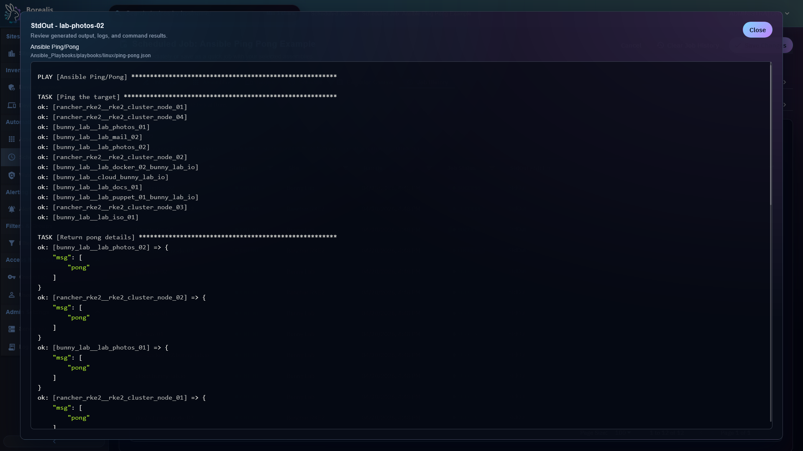

# Ansible Playbooks

Ansible playbook assemblies run from the Linux Engine against remote devices over Borealis-managed WireGuard paths. Use them for infrastructure-style automation when Ansible modules fit better than endpoint scripts.

<figure class="bo-screenshot">
  
  <figcaption>Ansible recaps expose Engine-side playbook execution output and per-target status.</figcaption>
</figure>

## Create Playbook Assembly

1. Open `Automation > Assemblies`.
2. Select `New Ansible Playbook`.
3. Add playbook content and metadata.
4. Save.

## Schedule Playbook

1. Create Scheduled Job.
2. Add Ansible playbook assembly.
3. Choose device or filter targets.
4. Choose execution context:
   - `ssh_individual`
   - `ssh`
   - `winrm_individual`
   - `winrm`
5. Select credential or service account path where applicable.
6. Save.

New Ansible jobs default to individual execution so each target gets separate status, output, and timeout handling. The Site Worker Scheduled Tasks value is the visible throttle for scheduled Ansible execution. `Engine.sh --network-mode public|local deploy` tunes that value from the detected Engine sizing profile.

The Site Worker Scheduled Tasks value limits active scheduled work items, not raw devices. Shared Ansible mode uses one work-item slot for a site batch and lets Ansible process the hosts inside that batch. Individual mode uses one work-item slot per target while active.

Each site worker launches at most two Ansible controller processes by default. Extra individual runs wait inside worker instead of exhausting K3s worker memory. Set `BOREALIS_SITE_WORKER_ANSIBLE_CONCURRENCY` before Engine deployment only when worker memory sizing supports higher parallelism.

## Read Recap

Run history shows target status and StdOut/StdErr. Playbook recap data captures Ansible results per host or run component.

## Credential Notes

SSH credentials may include password, private key, become method, and become password. Borealis chooses final SSH auth mode per target instead of blindly passing key and password together.

??? example "Detailed Codex Breakdown"

    ### API endpoints

    - Playbook execution is scheduled through [Scheduled Jobs](../scheduled-jobs.md).
    - Assembly CRUD endpoints are listed in [Assemblies](assemblies.md).
    - `GET /api/server/site-worker-settings` - read profile-managed scheduled-lane worker capacity.

    ### Related documentation

    - [Scheduled Jobs](../scheduled-jobs.md)
    - [Credential Management](../credential-management.md)
    - [SSH Connection Logic](../../Reference/ssh-connection-logic.md)
    - [Engine Runtime](../../Reference/Core%20Runtimes/engine-runtime.md)
    - [API Reference](../../Reference/Data%20and%20Schema/api-reference.md)

    ### Source map

    - Ansible runner: `Data/Engine/Containers/api-backend/data/services/ansible/runner.py`
    - SSH credential rendering: `Data/Engine/Containers/api-backend/data/services/ansible/ssh_auth.py`
    - Scheduler dispatch: `Data/Engine/Containers/api-backend/cmd/api-backend/scheduler_execution.go`
    - Scheduled job UI: `Data/Engine/Containers/webui-frontend/data/web-interface/src/Scheduling/Create_Job.jsx`

    ### Runtime behavior

    - Engine stages required Ansible collections into `Engine/Services/api-backend/cache/Ansible/collections`.
    - Shared contexts run one inventory per playbook component and consume one scheduled-lane worker slot for that site batch. The nodegraph can show `Task (8 Devices)` for one shared work item because the label reports target count, not slot count.
    - Individual contexts create one-host inventories and one run row per target/component pair. Each queued run consumes one scheduled-lane worker slot while active. The nodegraph can group several same-job, same-status runs into one `Task (n Devices)` card.
    - SSH/WinRM target admission depends on WireGuard readiness and credential/service-account resolution.
    - Legacy Ansible runner limit endpoints remain API-compatible but scheduler dispatch no longer uses them as active gates.
    - Site-worker scheduled-lane capacity is the active work-item claim limit. Profile values are `5`, `8`, `12`, or `16` scheduled work items per site worker; onboarding and other lanes are not changed by this setting.
    - Borealis does not currently pass `--forks` to Ansible. Shared batches use Ansible's default internal host fan-out inside the single claimed work item.
    - `BOREALIS_SITE_WORKER_ANSIBLE_CONCURRENCY` defaults to `2` and bounds simultaneous `ansible-playbook` controller processes per site-worker pod. This limit is separate from scheduled-lane work-item capacity.
    - VPN preparation receives a 45-second readiness window. Scheduler internal HTTP requests use their operation-specific context deadline instead of shorter shared-client timeout.
