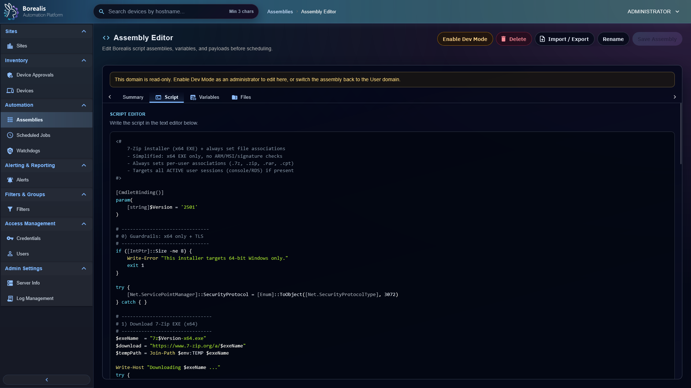

# Scripts

Script assemblies store reusable PowerShell, Batch, or Bash payloads. Use them for quick jobs, scheduled jobs, current-user tasks, SYSTEM remediation, and watchdog run-assembly actions.

<figure class="bo-screenshot">
  
  <figcaption>Assembly Editor captures reusable automation payloads, metadata, variables, and execution settings.</figcaption>
</figure>

## Create Script

1. Open `Automation > Assemblies`.
2. Select `New Script`.
3. Enter name and description.
4. Choose script subtype.
5. Add script body.
6. Add variables when operator input should be collected before execution.
7. Save.

## Run Script Quickly

Device Summary and Device List expose Quick Job actions. Pick script assembly, fill variables, choose target context, and run against selected devices.

## Schedule Script

Scheduled script jobs support:

- `system` context for elevated agent runtime.
- `current_user` context for helper-backed interactive user sessions.

If no eligible current-user helper exists, Borealis records dispatch failure instead of falling back to SYSTEM.

## Use Variables

Define variables in the assembly when values should change by run. Borealis injects variables into agent-side script environment and rewrites PowerShell `$env:VAR` references before dispatch.

??? example "Detailed Codex Breakdown"

    ### API endpoints

    - `POST /api/scripts/quick_run` - quick script run.
    - `GET /api/device/activity/<hostname>` - script activity history.
    - `DELETE /api/device/activity/<hostname>` - clear history.
    - `GET /api/device/activity/job/<job_id>` - activity record detail.
    - Assembly CRUD endpoints are listed in [Assemblies](assemblies.md).

    ### Related documentation

    - [Assemblies](assemblies.md)
    - [Scheduled Jobs](../scheduled-jobs.md)
    - [Watchdogs](../watchdogs.md)
    - [Agent Runtime](../../Reference/Core%20Runtimes/agent-runtime.md)
    - [Security Whitepaper](../../Reference/security-whitepaper.md)

    ### Source map

    - Script execution API: `Data/Engine/Containers/api-backend/cmd/api-backend/quick_run.go` and `agent_script.go`
    - Quick job dialog: `Data/Engine/Containers/webui-frontend/data/web-interface/src/Assemblies/Quick_Job_Dialog.jsx`
    - Agent system context role: `Data/Agent/internal/roles/system_context/`
    - Agent current-user role: `Data/Agent/internal/roles/current_user/`

    ### Runtime behavior

    - Engine signs script bytes with Ed25519 before dispatch.
    - Agent verifies signature before execution.
    - Quick-job results update `activity_history` and emit `device_activity_changed`.
    - Current-user runs route through SYSTEM broker into helper-ready sessions; helpers do not authenticate to Engine.
