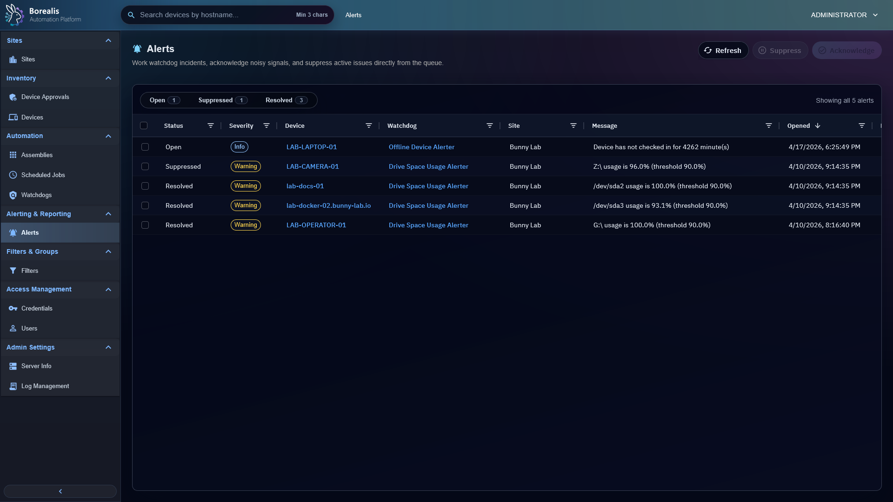

# Alerts

Alerts is the incident queue created by Watchdogs. Use it to triage active issues, acknowledge ownership, suppress known noise, and review resolved history.

<figure class="bo-screenshot">
  
  <figcaption>Alerts queue displays open, suppressed, and resolved incidents produced by watchdog evaluation.</figcaption>
</figure>

## Triage Queue

1. Open `Alerting & Reporting > Alerts`.
2. Use status pills for `Open`, `Suppressed`, or `Resolved`.
3. Use grid filters for severity, site, device, watchdog, message, and timestamps.
4. Open device hostname or watchdog name links when deeper context is needed.

Clicking the same status pill again clears that filter back to all alerts.

## Incident States

- `Open`: watchdog condition is active.
- `Acknowledged`: operator reviewed incident and recorded ownership.
- `Suppressed`: operator muted current incident without marking condition fixed.
- `Resolved`: condition cleared, policy disabled/archived, target disappeared, or telemetry became stale long enough to auto-resolve.

Offline-only incidents are purged when the device checks back in.

## Device-Level Alerts

Device Summary has a `Watchdogs` tab for active incidents, effective watchdog assignments, and device-level overrides. Use it when one device needs local context or a one-device suppression.

??? example "Detailed Codex Breakdown"

    ### API endpoints

    - `GET /api/watchdogs/incidents` - list incidents and queue counts.
    - `POST /api/watchdogs/incidents/<incident_id>/acknowledge` - acknowledge open incident.
    - `POST /api/watchdogs/incidents/<incident_id>/state` - move incident between open and suppressed.
    - `GET /api/devices/<device_id>/watchdogs` - device watchdog view.
    - `POST /api/devices/<device_id>/watchdogs/overrides` - device override.

    ### Related documentation

    - [Watchdogs](watchdogs.md)
    - [Device Auditing](device-auditing.md)
    - [Engine Log Management](engine-log-management.md)
    - [UI and Notifications](../Reference/ui-and-notifications.md)

    ### Source map

    - Alerts UI: `Data/Engine/Containers/webui-frontend/data/web-interface/src/Alerting/Active_Alerts.jsx`
    - Device Watchdogs UI: `Data/Engine/Containers/webui-frontend/data/web-interface/src/Devices/Tabs/Device_Watchdogs.jsx`
    - Runtime: `Data/Engine/Containers/api-backend/data/services/API/watchdogs/runtime.py`

    ### Runtime behavior

    - Queue-level suppression is an incident state transition.
    - Device-level suppressions live separately in `watchdog_device_overrides`.
    - Incident rows include watchdog, device, site, severity, title, sampled data, acknowledgement metadata, and timestamps.
