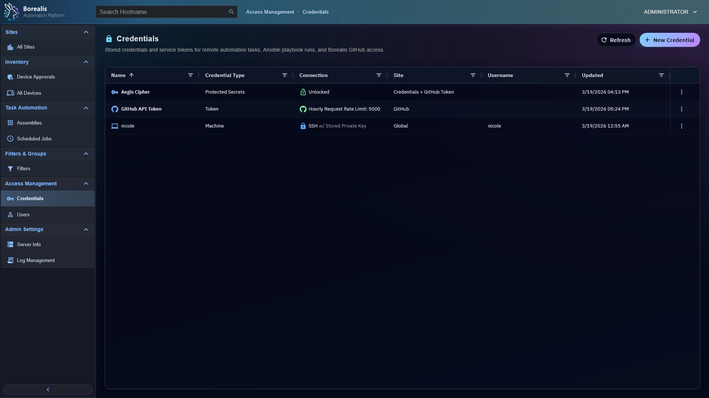

# Credential Management

Credential Management stores reusable secrets for remote onboarding, SSH/WinRM automation, scheduled Ansible, and Borealis service tokens. Aegis Cipher protects stored secret material at rest.

<figure class="bo-screenshot">
  
  <figcaption>Credential Management stores reusable credentials for onboarding, remote access, and automation workflows.</figcaption>
</figure>

## Add Credential

1. Open `Access Management > Credentials`.
2. Select `New Credential`.
3. Name the credential.
4. Choose optional site scope.
5. Pick credential type and connection type.
6. Enter username and secret material.
7. Add optional privilege escalation details.
8. Save.

## Pick Credential Scope

- Site-scoped credentials fit customer or lab boundaries.
- Global credentials should be rare and intentionally named.
- Scheduled jobs and onboarding use credential records by ID; secret material is not copied into job definitions.

## Use Stored Credential for Windows RDP

Remote Desktop can use credential when all following match:

- Connection type is `Windows` or `WinRM`.
- Credential type is `Machine` or `Domain`.
- Username and password are present and do not need Aegis recovery.
- Site scope is global or matches selected device site.

Use `DOMAIN\\username` or user principal name when Windows domain context is required. Remote Desktop selector receives credential metadata only. Engine validates scope again, decrypts password server-side for session setup, and never returns stored secret to browser.

## Manage Aegis Cipher

Credentials page also shows Aegis status and runtime actions after bootstrap. Use rotation when changing the cipher intentionally. Force reset is disaster recovery and destroys stored secret material that cannot be decrypted.

!!! warning

    Aegis force reset disables or marks credential-backed jobs until missing secrets are re-entered.

??? example "Detailed Codex Breakdown"

    ### API endpoints

    - `GET /api/credentials` - list credentials without secret material.
    - `GET /api/credentials/<credential_id>` - get one credential without secret material.
    - `POST /api/credentials` - create credential.
    - `PUT /api/credentials/<credential_id>` - update credential.
    - `DELETE /api/credentials/<credential_id>` - delete credential.
    - `GET /api/github/token` - GitHub token status.
    - `POST /api/github/token` - update GitHub token.

    ### Related documentation

    - [Scheduled Jobs](scheduled-jobs.md)
    - [Ansible Playbooks](Assemblies/ansible-playbooks.md)
    - [Directory Services](directory-services.md)
    - [Security Whitepaper](../Reference/security-whitepaper.md)
    - [Database Reference](../Reference/Data%20and%20Schema/db-reference.md)

    ### Source map

    - Credentials API: `Data/Engine/Containers/api-backend/cmd/api-backend/credentials.go` and `credentials_mutations.go`
    - Aegis service: `Data/Engine/Containers/api-backend/cmd/api-backend/aegis.go`, `aegis_crypto.go`, and `aegis_lifecycle.go`
    - Credentials UI: `Data/Engine/Containers/webui-frontend/data/web-interface/src/Access_Management/Credential_List.jsx`
    - Credential editor: `Data/Engine/Containers/webui-frontend/data/web-interface/src/Access_Management/Credential_Editor.jsx`

    ### Runtime behavior

    - Credential records live in `credentials`.
    - Secret fields store `aegis:v1:` envelopes after Aegis setup.
    - Job workers fetch decrypted credential material only at execution time through internal Engine paths.
    - Windows RDP session setup uses same internal scheduler credential decryption path. Public request carries credential ID; Engine enforces device-site scope plus `machine|domain` and `windows|winrm` classification before sending resolved secret to authenticated site-worker.
