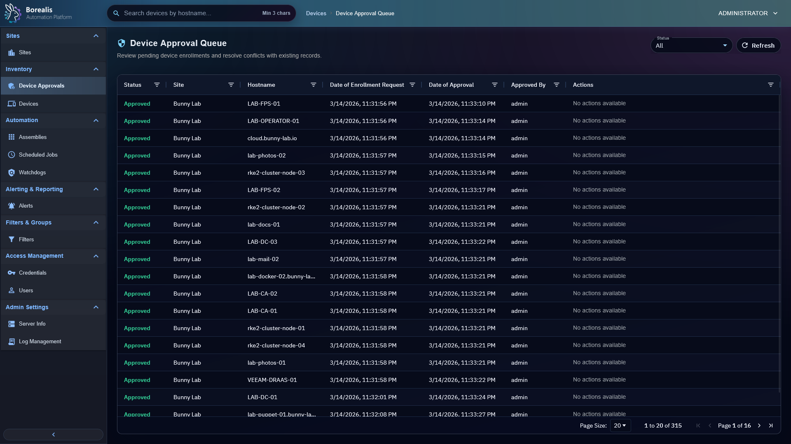

# Device Approvals

Device Approvals is the trust gate for new agents. Use it to review enrollment requests before a device becomes manageable in Borealis.

<figure class="bo-screenshot">
  
  <figcaption>Device Approval Queue holds enrollment requests until an authorized operator approves or rejects them.</figcaption>
</figure>

## Review Pending Devices

1. Open `Inventory > Device Approvals`.
2. Review hostname, site, enrollment code, approval reference, and request age.
3. Approve devices you recognize.
4. Reject requests that came from the wrong site, wrong code, unknown host, or unexpected fingerprint.

Admins can see all approvals. Non-admin operators see approvals only for assigned sites.

## Handle Hostname Conflicts

If a requested hostname conflicts with an existing device, Borealis keeps that row pending for explicit review. Resolve conflict instead of bulk-approving blindly.

## Bulk Approve

Bulk approval works for selected pending rows that do not need conflict resolution. Rows with conflicts remain pending.

## Wrong-Code Attempts

Admins can use the invalid-code view to spot agents that are actively submitting bad enrollment codes. Borealis stores masked code data only, not full wrong codes.

## Temporary Auto-Approval

Sites can carry a temporary `auto_approve_until` window. During that window, safe enrollments for the site are approved automatically unless hostname or identity conflict checks require review.

!!! warning

    Approval grants device trust. Do not approve devices from unknown sites, stale onboarding attempts, or unexpected hostnames.

??? example "Detailed Codex Breakdown"

    ### API endpoints

    - `GET /api/admin/device-approvals` - approval queue scoped to operator site access.
    - `POST /api/admin/device-approvals/<approval_id>/approve` - approve one request.
    - `POST /api/admin/device-approvals/<approval_id>/deny` - deny one request.
    - `GET /api/admin/device-approvals?status=wrong_code` - recent invalid-code attempts for admins.
    - `POST /api/sites/<site_id>/auto-approval` - set or clear temporary site auto-approval.

    ### Related documentation

    - [Sites](sites.md)
    - [Site Assignments](site-assignments.md)
    - [Security and Trust](../Reference/security-and-trust.md)
    - [Database Reference](../Reference/Data%20and%20Schema/db-reference.md)

    ### Source map

    - Approval API: `Data/Engine/Containers/api-backend/data/services/API/devices/approval.py`
    - Enrollment tables: `device_approvals`, `enrollment_code_failures`
    - Device approval route: `Data/Engine/Containers/webui-frontend/data/web-interface/src/app/routes/router.jsx`

    ### Runtime behavior

    - Enrollment requests create pending approval rows tied to site context.
    - Approval verifies hostname conflicts and device identity data before final trust is issued.
    - Automatic local-network onboarding still uses normal approval. It can add `onboarding_job_id`, `onboarding_run_id`, and `onboarding_target` for traceability.
