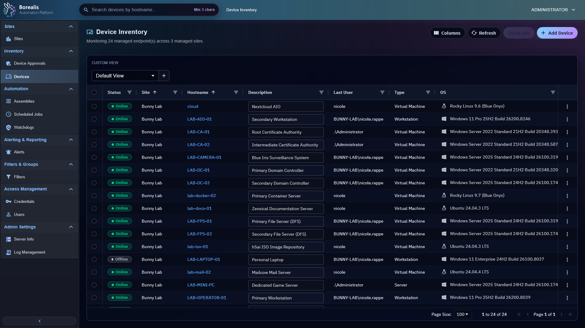

# Device Auditing

Device Auditing is the normal starting point for understanding a managed endpoint. Use it to read current inventory, online state, role health, software, services, sessions, activity history, and device-specific operational tabs.

<figure class="bo-screenshot">
  
  <figcaption>Device Inventory shows managed endpoints, site assignment, status, user, type, and operating system.</figcaption>
</figure>

## Open Device Inventory

1. Open `Inventory > Devices`.
2. Search or filter by hostname, site, status, user, type, or operating system.
3. Select a device hostname to open Device Summary.
4. Use saved table views when you need repeatable columns and filters for routine audits.

## Read Device Summary

Device Summary collects the last-known inventory and action tabs for one endpoint.

- `Device Summary` shows high-level identity, OS, hardware, network, current user, uptime, and description.
- `Installed Software` shows software inventory and software actions.
- `Services`, `Processes`, `File Management`, `Remote Shell`, and `Remote Desktop` are live operations tabs.
- `Activity History` shows quick job and automation output tied to the device.
- `Watchdogs` shows active incidents, effective watchdog assignments, and device-level suppressions.
- `Agent Health` shows startup flow and role health separately from online/offline status.

## Understand Status

- `Online` means the Engine saw a recent heartbeat.
- `Offline` means heartbeat age exceeded the online window.
- Agent Health explains startup and role state; it does not replace online/offline status.
- Stale inventory means the device may be online but a specific role has not published fresh data yet.

!!! tip

    Start with Device Summary and Agent Health before opening logs. Most device-side issues show as stale heartbeat, failed role, missing helper readiness, or offline state.

## Common Checks

- Device missing from normal inventory: verify it is approved and assigned to a site you can see.
- Wrong site: update site assignment from Sites or the device assignment flow.
- Software, service, or process data stale: use the tab refresh action or wait for the next agent poll.
- Current-user automation unavailable: check session helper readiness in Agent Health and session inventory.

??? example "Detailed Codex Breakdown"

    ### API endpoints

    - `GET /api/devices` - device list scoped to operator site access.
    - `GET /api/devices/search?hostname=<query>` - shared hostname search.
    - `GET /api/devices/<guid>` - device summary by GUID.
    - `GET /api/device/details/<hostname>` - detailed device payload.
    - `POST /api/agent/heartbeat` - heartbeat, metrics, and metadata sync.
    - `POST /api/agent/status` - startup timeline and role health update.
    - `POST /api/agent/details` - full inventory payload.
    - `GET /api/device/activity/<hostname>` - activity history.
    - `DELETE /api/device/activity/<hostname>` - clear activity history.

    ### Related documentation

    - [Agent Runtime](../Reference/Core%20Runtimes/agent-runtime.md)
    - [Database Reference](../Reference/Data%20and%20Schema/db-reference.md)
    - [API Reference](../Reference/Data%20and%20Schema/api-reference.md)
    - [Security and Trust](../Reference/security-and-trust.md)

    ### Source map

    - Device APIs: `Data/Engine/Containers/api-backend/data/services/API/devices/`
    - Device Summary UI: `Data/Engine/Containers/webui-frontend/data/web-interface/src/Devices/Tabs/Device_Summary.jsx`
    - Agent Health UI: `Data/Engine/Containers/webui-frontend/data/web-interface/src/Devices/Tabs/Agent_Health.jsx`
    - Agent audit role: `Data/Agent/internal/roles/device_audit/`

    ### Runtime behavior

    - Online/offline status is derived from `devices.last_seen`.
    - Heavy inventory lands through `/api/agent/details`; heartbeat carries lightweight metrics and metadata deltas.
    - Session inventory includes helper readiness fields so current-user execution can distinguish a logged-in user from a helper-ready session.
    - Software data is stored both in `devices.software` for UI detail and `device_software_inventory` for reliable filter matching.
