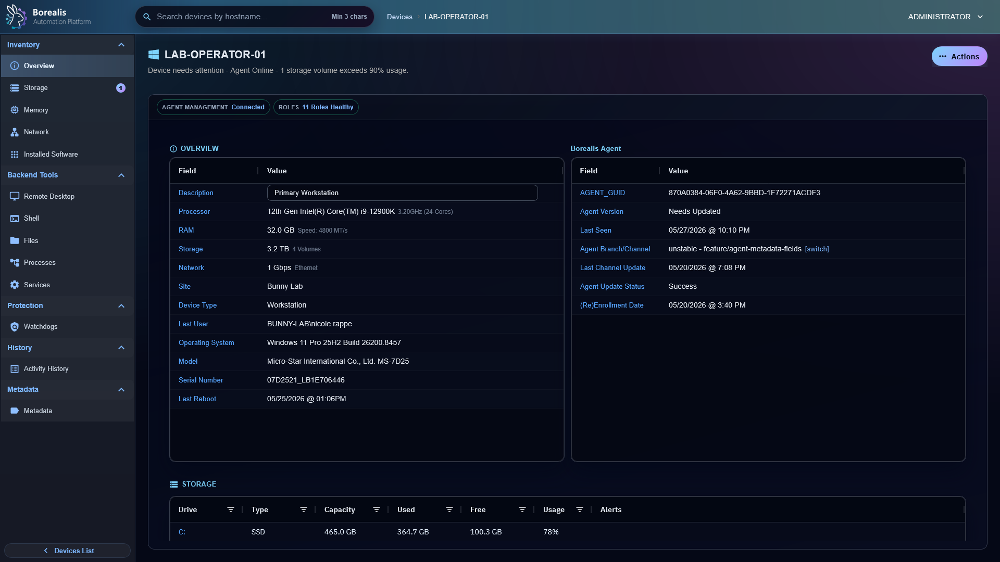

# Using the Platform

Use this section for daily Borealis work: sites, inventory, approvals, filters, automation, alerts, remote operations, access management, and Engine administration.

<figure class="bo-screenshot">
  
  <figcaption>Device Summary centralizes inventory, role health, actions, and remote workflows.</figcaption>
</figure>

## Fleet

- [Sites](sites.md) - create site containers, copy install commands, and start onboarding.
- [Site Assignments](site-assignments.md) - control which sites non-admin operators can see.
- [Device Auditing](device-auditing.md) - read inventory, status, activity, and Agent health.
- [Device Approvals](device-approvals.md) - approve or reject newly enrolled agents.
- [Device Filters](device-filters.md) - build reusable dynamic target sets.
- [Metadata Fields](metadata-fields.md) - label and fill custom device metadata.

## Operations

- [Remote Desktop](remote-desktop.md) - launch shared browser VNC sessions.
- [Remote Shell](remote-shell.md) - open WireGuard-backed PowerShell or shell sessions.
- [File Management](file-management.md) - browse, transfer, edit, rename, move, and delete files.
- [Registry Editor](registry-editor.md) - browse and edit Windows registry keys and values.
- [Process Management](process-management.md) - inspect live processes and end tasks.
- [Service Management](service-management.md) - inspect services and send start, stop, or restart actions.
- [Software Management](software-management.md) - audit installed software, refresh inventory, and run supported uninstall actions.

## Automation

- [Assemblies](Assemblies/assemblies.md) - understand the automation catalog and Aurora source.
- [Scripts](Assemblies/scripts.md) - author and run PowerShell, Batch, and Bash assemblies.
- [Workflows](Assemblies/workflows.md) - build visual React Flow automations.
- [Ansible Playbooks](Assemblies/ansible-playbooks.md) - run Engine-side playbooks over SSH or WinRM.
- [Scheduled Jobs](scheduled-jobs.md) - run automation now or on recurring schedules.
- [Watchdogs](watchdogs.md) - turn device telemetry into incidents and remediation.
- [Alerts](alerts.md) - triage open, suppressed, and resolved watchdog incidents.

## Administration

- [Credential Management](credential-management.md) - store remote execution credentials and service tokens.
- [Directory Services](directory-services.md) - configure LDAP, LDAPS, and Active Directory login providers.
- [User Management](user-management.md) - manage local and cached directory operators.
- [Backup and Restore](backup-restore.md) - export or import encrypted Engine configuration backups.
- [Server Info](server-info.md) - inspect Engine runtime health and service controls.
- [Engine Status](engine-status.md) - read the live worker and service topology canvas.
- [Engine Log Management](engine-log-management.md) - browse logs, set retention, and open raw log files.
