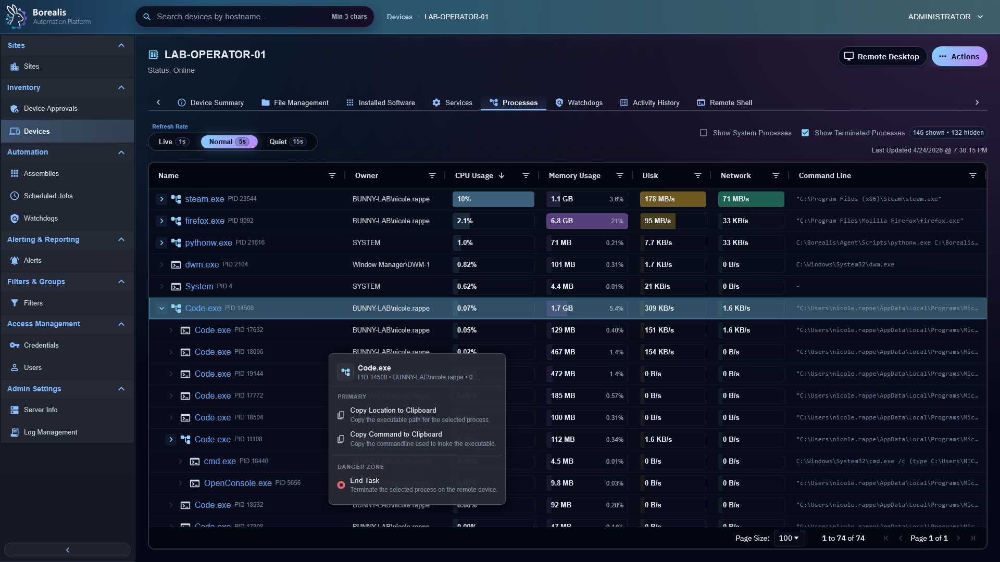

# Process Management

Process Management gives operators a live task-manager style view for one device. Use it to inspect resource use, copy process details, and send End Task when a process needs to stop.

<figure class="bo-screenshot">
  
  <figcaption>Process Manager provides task-manager style process inspection, resource columns, and operator actions.</figcaption>
</figure>

## Inspect Processes

1. Open a device.
2. Open `Processes`.
3. Choose refresh rate: `Live`, `Normal`, or `Quiet`.
4. Toggle `Show System Processes` when low-level OS rows matter.
5. Toggle `Show Terminated Processes` to keep recent exits visible.

Columns show name, owner, CPU, memory, disk, network, and command line.

## End Task

1. Right-click a process row.
2. Choose `End Task`.
3. Confirm the process disappears or moves into terminated visibility after refresh.

## Copy Details

Right-click row actions can copy executable location or command line. Use this before shell work so commands target the right path.

!!! warning

    End Task can stop user work, services, or critical application components. Confirm owner, command line, and parent/child grouping before acting.

??? example "Detailed Codex Breakdown"

    ### API endpoints

    - `GET /api/device/processes/<hostname>?max_age_seconds=<seconds>` - live process snapshot.
    - `POST /api/device/processes/<hostname>/terminate` - request process termination.

    ### Related documentation

    - [Device Auditing](device-auditing.md)
    - [Agent Runtime](../Reference/Core%20Runtimes/agent-runtime.md)
    - [API Reference](../Reference/Data%20and%20Schema/api-reference.md)

    ### Source map

    - Process API: `Data/Engine/Containers/api-backend/cmd/api-backend/device_processes.go`
    - Process tab UI: `Data/Engine/Containers/webui-frontend/data/web-interface/src/Devices/Tabs/Process_Management.jsx`
    - Agent process role: `Data/Agent/internal/roles/process_management/`

    ### Runtime behavior

    - Live snapshots use the device SYSTEM Socket.IO channel through `process_management_request`.
    - UI polling requests fresher agent snapshots when refresh rate needs it.
    - Cached process inventory still exists for watchdog rules and is separate from live process-management snapshots.
