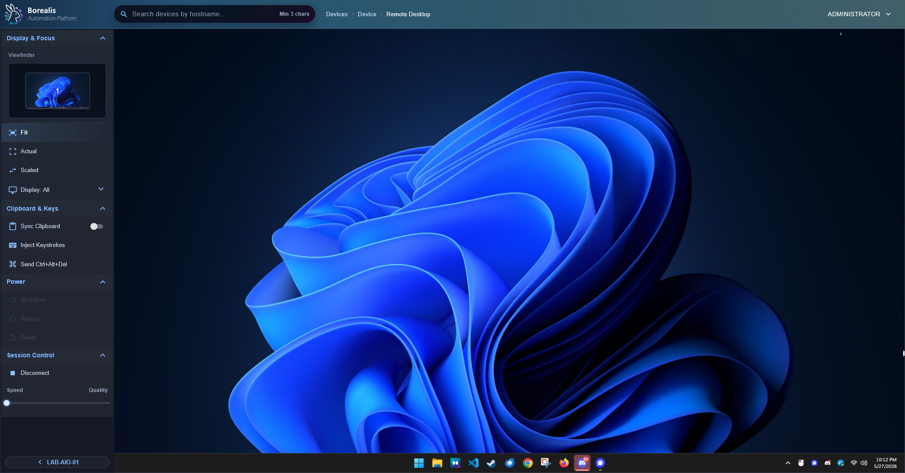

# Remote Desktop

Remote Desktop opens a shared browser VNC session to a Windows agent through Borealis-managed WireGuard and Apache Guacamole. Use it when visual support is faster than shell, file, process, or service tools.

<figure class="bo-screenshot">
  
  <figcaption>Remote Desktop uses browser VNC through Guacamole over the managed WireGuard tunnel.</figcaption>
</figure>

## Launch Session

1. Open a Windows device.
2. Open `Remote Desktop`.
3. Select `Launch Remote Desktop`.
4. Wait for readiness checks.
5. Work in the browser viewer.

If another operator already has the device open, Borealis joins the same shared collaboration session.

!!! info

    Slower endpoints can spend extra time on `Authenticating Session` while the Agent finishes VNC service and listener checks. Borealis continues probing before failing so underpowered virtual machines have time to become ready.

## Use Session Controls

- Reconnect if the browser stream drops after it was already ready.
- Adjust speed/quality preference when bandwidth is constrained.
- Use the always-open display selector or the viewfinder to fit the full desktop or focus one monitor when the Windows endpoint has multiple displays.
- After a display is selected, Borealis switches the viewer to `Fit`, clips video and mouse input to that display, and previews that display region by itself. The viewfinder center-fits multi-display layouts so wide monitor spans stay inside the sidebar preview.
- Use `Fit` or `Scaled` when `Display: All` is selected. Single-display focus uses `Fit` only.
- Use Ctrl+Alt+Del from session controls when Windows secure desktop needs it.
- Disconnect when finished. Closing the browser leaves a short reconnect window.

## Availability Rules

- Remote Desktop needs a supported Windows agent.
- Agent must be online with WireGuard and VNC roles healthy.
- `guacd` must be available on the Engine.
- Browser traffic stays same-origin under Borealis HTTPS; no separate public VNC endpoint is used.

!!! tip

    If Remote Desktop is unavailable, check Device Summary Agent Health first, then Server Info for `remote-desktop-guacd` health.

??? example "Detailed Codex Breakdown"

    ### API endpoints

    - `GET /api/vnc/viewers` - report Guacamole availability.
    - `POST /api/vnc/establish` - establish or join VNC collaboration session.
    - `POST /api/vnc/disconnect` - leave or close session.
    - `POST /api/vnc/handoff` - reassign session-owner metadata.
    - `GET /api/vnc/sessions` - list active sessions.
    - `POST /api/agent/vnc/ensure` - agent readiness and session metadata.

    ### Related documentation

    - [Remote Shell](remote-shell.md)
    - [Server Info](server-info.md)
    - [Agent Runtime](../Reference/Core%20Runtimes/agent-runtime.md)
    - [Engine Runtime](../Reference/Core%20Runtimes/engine-runtime.md)
    - [Security Whitepaper](../Reference/security-whitepaper.md)

    ### Source map

    - Remote Desktop UI: `Data/Engine/Containers/webui-frontend/data/web-interface/src/Devices/Tabs/Remote_Desktop.jsx`
    - VNC API: `Data/Engine/Containers/api-backend/data/services/API/devices/vnc.py`
    - VNC proxy: `Data/Engine/Containers/api-backend/data/services/RemoteDesktop/vnc_proxy.py`
    - Guacamole bridge: `Data/Engine/Containers/api-backend/data/services/RemoteDesktop/guacamole_proxy.py`
    - Agent VNC role: `Data/Agent/internal/roles/vnc/`

    ### Runtime behavior

    - Engine asks the Agent for the current runtime VNC credential only when establishing a live session.
    - Browser receives a Borealis one-time token, not the UltraVNC password.
    - Guacamole connects through local `guacd`, then to the agent VNC listener over WireGuard.
    - VNC role keeps UltraVNC available after firewall scope and runtime credentials are ready.
    - Agent VNC config sets UltraVNC `[admin]` values `primary=1` and `secondary=1` so multi-monitor Windows endpoints start Guacamole sessions with the full desktop framebuffer instead of primary-only capture.
    - VNC establish performs a fast TCP probe first, then bounded recovery and restart probes for Agent readiness. Engine-side establish work is capped by `BOREALIS_VNC_ESTABLISH_DEADLINE_SECONDS`, defaulting to 30 seconds and clamped to 30 seconds so operators do not wait through multi-minute browser launches.
    - Site-worker registration can perform a bounded RFB VNCAuth probe before the browser socket opens when `BOREALIS_VNC_AUTH_PROBE=1`. Keep this diagnostic off by default because each probe consumes an UltraVNC login attempt and can trigger lockout or credential-rotation recovery on slower endpoints. The Go broker requests a scoped auth probe for Remote Desktop launches so invalid UltraVNC auth fails before Guacamole opens its own retry loop.
    - Engine VNC readiness waits can be tuned with `BOREALIS_VNC_ESTABLISH_DEADLINE_SECONDS`, `BOREALIS_VNC_LIVE_CREDENTIAL_WAIT_SECONDS`, `BOREALIS_VNC_START_READY_WAIT_SECONDS`, `BOREALIS_VNC_RECOVERY_READY_WAIT_SECONDS`, `BOREALIS_VNC_RESTART_READY_WAIT_SECONDS`, `BOREALIS_VNC_AUTH_RETRY_CREDENTIAL_WAIT_SECONDS`, `BOREALIS_VNC_AUTH_RETRY_START_READY_WAIT_SECONDS`, `BOREALIS_VNC_AUTH_RETRY_READY_WAIT_SECONDS`, `BOREALIS_VNC_AUTH_RETRY_COOLDOWN_SECONDS`, and `BOREALIS_VNC_AUTH_LOCKOUT_COOLDOWN_SECONDS`. Per-step waits and auth retry cooldowns are clipped to the active establish deadline.
    - Engine calls Agent `vnc_start` synchronously through the site-worker before issuing a browser Guacamole token, so stale TCP listener probes cannot race ahead of Agent-side VNC config and service readiness.
    - Browser startup waits give slower site-worker, `guacd`, and framebuffer paths enough time before reconnecting, so failed first frames do not churn new Guacamole tokens every few seconds.
    - Engine debounces Agent `vnc_stop` after operator disconnect with `BOREALIS_VNC_STOP_DEBOUNCE_SECONDS` so quick reconnects do not fight an in-flight UltraVNC stop.
    - Site-worker emits `first_frame` events after Guacamole sees the first display instruction, and the Engine records `first_frame_at` on the shared VNC session snapshot.
    - Guacamole startup treats post-ready backend status `519` as retryable, opens a fresh `guacd` session, and keeps `participant_id` plus token hints in VNC proxy logs for browser-to-Engine correlation. The site-worker owns a short retry loop while Guacamole VNC `autoretry` is disabled, so one browser launch cannot multiply into many hidden UltraVNC connection attempts.
    - If a browser-side Guacamole session hits UltraVNC auth lockout, the site-worker reports `vnc_auth_failed` on session close. The next establish request uses the existing Agent `vnc_auth_retry` reason so the Agent rotates the runtime VNC credential and rewrites UltraVNC config without changing Agent code.
    - Engine treats `vnc_auth_retry` as single-flight per Agent. While UltraVNC is restarting or settling after credential rotation, additional establish requests receive `vnc_auth_retry_in_progress` or `vnc_auth_retry_settling` with `retry_after_seconds` instead of sending another credential rotation request. Auth retry and UltraVNC lockout settle hints are capped at 30 seconds; after that window, the next establish tries a normal current-credential request plus a request-scoped RFB auth probe before rotating again.
    - Remote Desktop speed/quality preferences flow from WebUI through the Go VNC broker into the site-worker Guacamole session as `-2` through `2`; the default favors speed for lower-end endpoints.
    - WebUI display focus is client-side only: Guacamole keeps one full-framebuffer VNC session, while `Remote_Desktop.jsx` positions and scales the Guacamole display element inside an overflow-hidden clip layer to crop one monitor. `Display: All` supports `Fit` and `Scaled`; single-display focus forces `Fit` and clamps mouse coordinates to the selected display.
    - Windows Agent display topology prefers active monitor geometry from `EnumDisplayMonitors` when that data is at least as complete as `EnumDisplaySettingsEx`. This preserves physical positions such as secondary monitors to the left of the primary monitor instead of trusting a stale or flattened display-settings layout.
    - When live Agent topology only reports one display but the Guacamole framebuffer is clearly wider, WebUI uses `display_virtual_bounds` first to project the reported monitor into framebuffer coordinates, then uses reported framebuffer gaps when one monitor size is known. If Windows collapses the whole desktop into one very-wide display, WebUI uses aspect-ratio priors to expose best-effort display rows without hardcoding pixel resolutions.
    - Agent VNC readiness serializes local service checks, gives pending services time to settle, force-kills stuck `STOP_PENDING` UltraVNC processes after grace time, and waits for the listener before reporting ready.
