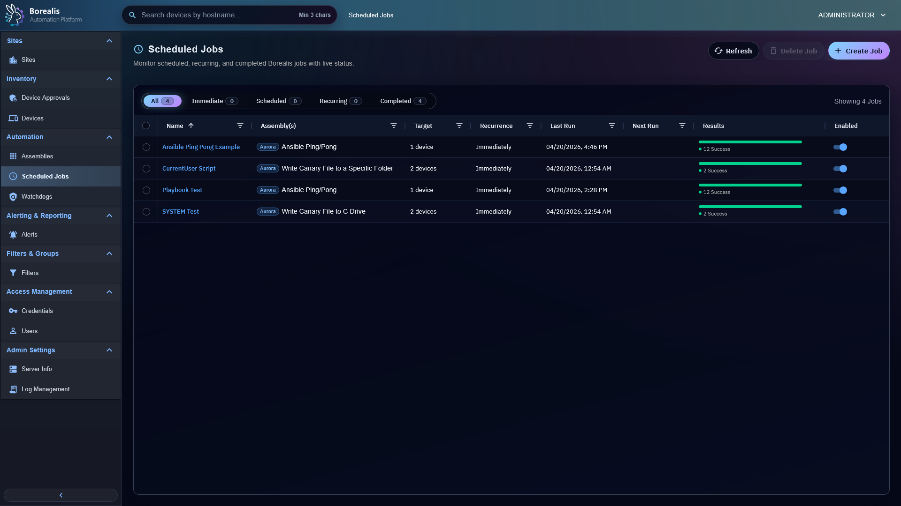

# Scheduled Jobs

Scheduled Jobs run saved automation now, once, or on a recurring cadence. Use them for routine script runs, workflow launches, Engine-side Ansible playbooks, agent maintenance, Windows patch installs, and local-network onboarding.

<figure class="bo-screenshot">
  
  <figcaption>Scheduled Job List shows recurring automation, onboarding jobs, status, cadence, and recent results.</figcaption>
</figure>

## Create Job

1. Open `Automation > Scheduled Jobs`.
2. Select `New Job`.
3. Name the job.
4. Add one or more compatible assemblies.
5. Choose targets: devices or filters.
6. Choose schedule.
7. Choose execution context when needed.
8. Save.

Script jobs can target SYSTEM or current user. Ansible jobs target SSH or WinRM. Workflow jobs use the workflow's own runtime model and ignore scheduler-level targets/context. Patch Management opens this page on the `Schedule` tab with the selected KB, trigger type, targets, and return path already filled when operators schedule an ad-hoc Windows update install. Bulk patch installs use this page for shared timing, then create one scheduled job per selected patch.

Patch policies also create scheduled jobs, but operators configure them from the Windows page under `Patch Management > Windows` by selecting the `Site Policies` or `Device / Filter Policies` tab. Each policy run creates one `Patch Management` job per approved KB/update identity so normal job history and per-device progress stay preserved.

## Choose Schedule

Common schedule types include immediate, once, every 5/10/15/30 minutes, hourly, daily, weekly, monthly, and yearly.

Scheduled wall-clock times use the Engine host timezone. If the Engine host is configured for `America/Denver`, a daily job set for `12:00 AM` runs at midnight in that timezone even when an operator browser or API client is in another timezone.

## Read Results

- Current Run shows live or latest run state.
- Historical Runs groups past occurrences.
- Device rows show target status, output, errors, and skipped reasons.
- Ansible playbooks store per-target or shared recap output depending on execution mode.
- Patch install jobs store per-device install result, timeout or failure state, WUA result codes, reboot-required flags, and available Windows Update stdout/stderr detail.

The job list opens on the `Normal` filter so operator-created automation and onboarding jobs stay separate from internal maintenance and patch-install noise. Use `Maintenance` to audit internal Agent or Engine maintenance jobs, and use `Patch Management` to review Windows patch-install jobs created from Patch Management. `Immediate`, `Scheduled`, `Recurring`, and `Completed` narrow normal jobs only.

## Onboarding Jobs

Sites can launch local-network onboarding jobs that appear in Scheduled Jobs. They use discovery scope, exclusions, stored credentials, platform selection, install branch, remote ports, and concurrency limits. Successful install still requires Device Approval.

!!! tip

    Use filters for recurring jobs when membership should change as inventory changes. Use explicit devices when target list must stay obvious and small.

??? example "Detailed Codex Breakdown"

    ### API endpoints

    - `GET /api/scheduled_jobs` - list visible jobs.
    - `POST /api/scheduled_jobs` - create job.
    - `GET /api/scheduled_jobs/<job_id>` - get job.
    - `PUT /api/scheduled_jobs/<job_id>` - update job.
    - `POST /api/scheduled_jobs/<job_id>/toggle` - enable or disable.
    - `POST /api/scheduled_jobs/<job_id>/rerun` - queue immediate occurrence from saved config.
    - `DELETE /api/scheduled_jobs/<job_id>` - delete job.
    - `GET /api/scheduled_jobs/<job_id>/runs` - run history.
    - `GET /api/scheduled_jobs/<job_id>/devices` - device results.
    - `DELETE /api/scheduled_jobs/<job_id>/runs` - clear run history.
    - `POST /api/onboarding/jobs/<job_id>/redeploy` - rerun onboarding from saved config.
    - `GET /api/onboarding/jobs/<job_id>/targets` - onboarding target details and approval context.

    ### Related documentation

    - [Scripts](Assemblies/scripts.md)
    - [Workflows](Assemblies/workflows.md)
    - [Ansible Playbooks](Assemblies/ansible-playbooks.md)
    - [Device Filters](device-filters.md)
    - [Sites](sites.md)
    - [SSH Connection Logic](../Reference/ssh-connection-logic.md)

    ### Source map

    - API: `Data/Engine/Containers/api-backend/cmd/api-backend/scheduled_jobs*.go`
    - Scheduler queue and tick manager: `Data/Engine/Containers/api-backend/cmd/api-backend/scheduler_manager.go`
    - Scheduled script/Ansible dispatch: `Data/Engine/Containers/api-backend/cmd/api-backend/scheduler_execution.go`
    - Site worker runtime: `Data/Engine/Containers/api-backend/data/services/job_scheduler/worker.py`
    - UI: `Data/Engine/Containers/webui-frontend/data/web-interface/src/Scheduling/`

    ### Runtime behavior

    - `job-scheduler` owns scheduled ticks, queue leases, service actions, and site-worker lifecycle.
    - `job_kind=patch_install` stores a single `patch_install` component, uses system execution context, and bypasses assembly credential selection.
    - New Patch Management drafts expose only the `Schedule` tab in `Create_Job.jsx`; Patch Management supplies job name, patch component, target list, and system execution context.
    - New Patch Management drafts include an internal `return_to` route so successful creation returns to the originating fleet or device Patch Management page.
    - Bulk Patch Management drafts never store multiple KBs in one job. `Create_Job.jsx` loops over selected patch items and creates one `job_kind=patch_install` scheduled job for each patch using the same schedule/duration payload.
    - Schedule create/update accepts offsetless wall-clock values such as `2026-06-25T00:00` as Engine-local time. Offset-bearing RFC3339 values remain absolute instants.
    - Daily, weekly, monthly, and yearly recurrence preserves Engine-local wall-clock time across daylight saving changes.
    - Site workers execute site-scoped pressure work outside `api-backend`.
    - Each due occurrence resolves targets once and freezes membership in run target rows.
    - Filter targets preserve allowed site scope from creation/edit time.
    - Remote SSH/WinRM Ansible requires active WireGuard peer IP and selected credential or service account path.
    - Patch install occurrences freeze target membership, queue `patch_install_run` work items, then call the site worker host-service bridge so the Agent SYSTEM socket performs WUA install work.
    - Patch policy evaluation runs from the scheduler manager before normal scheduled-job ticks. Due policies create immediate `job_kind=patch_install` jobs with `trigger=policy`, `policy_id`, and `policy_run_id` in the patch component.
    - Policy-created patch jobs still use regular scheduled-job run history, target rows, activity output, and progress metadata. Operators review them through the Scheduled Jobs `Patch Management` filter.
    - `Scheduled_Jobs_List.jsx` defaults to the `Normal` filter. Normal, Immediate, Scheduled, Recurring, and Completed exclude `agent_maintenance` and `patch_install` job kinds. `Maintenance` includes Agent maintenance and future job-kind names with a standalone `maintenance` token. `Patch Management` includes patch job-kind names such as `patch_install`.
