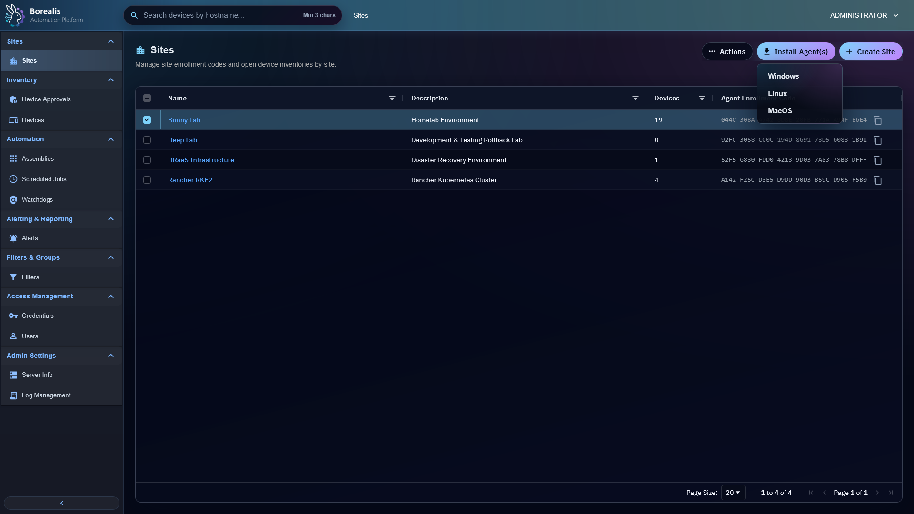

# Sites

Sites group devices for enrollment, operator visibility, targeting, onboarding, and organization. Create sites before enrolling agents so every new device lands in the right operational boundary.

<figure class="bo-screenshot">
  
  <figcaption>Sites group devices for enrollment, operator visibility, targeting, and organization.</figcaption>
</figure>

## Create Site

1. Open `Sites > Sites`.
2. Select `Create Site`.
3. Enter name and optional description.
4. Save.
5. Copy the site install command when deploying agents for that site.

Each site has its own enrollment code. Agent install commands include the selected Engine URL and site enrollment code. Internal-Only Engine commands also include Borealis local CA data so the Agent can validate the Engine FQDN without disabling TLS verification. Internal-Only commands also include an Engine IP fallback so agents without private DNS can enroll and reconnect while keeping the FQDN as the trusted HTTPS identity. Linux agents also use that fallback to start WireGuard when endpoint DNS fails.

## Assign Devices

Use site assignment actions when a device was approved without the expected site, moved between customers, or needs admin review. Devices without site assignment are admin-only.

## Onboard Devices

Use `Onboard Devices` from the Sites page when the Engine should attempt local-network agent installation against Linux or Windows targets.

Onboarding jobs still send agents through Device Approvals. Successful remote install means the agent reached Borealis, not that it is trusted yet.

## Read Worker Resource Usage

The Sites grid shows live Docker resource usage for each active site-worker when Engine Docker metadata is available. Use CPU, RAM, NET, and DISK mini-trends inside the Site Worker Container column to spot workers under load.

Resource mini-trends refresh with the site-worker payload every 5 seconds and keep only the last 60 seconds in the browser. On page load, Sites renders site records first, then starts worker polling immediately after the first render without blocking site names or descriptions. Site Worker Container shows `Polling Site Worker Metrics` and Connected Devices shows `Analyzing Agent Connections` until the first successful worker payload arrives. Mini-trends and connection bars display as soon as Docker stats are available. K3s bridge workers can be active before Borealis has Kubernetes-native resource metrics; those rows show `Worker Metrics Unavailable` instead of `Site Worker Not Running`. Navigating away from Sites clears that short history. Sites with no active site worker show `Site Worker Not Running`.

The Connected Devices bar uses the last known connected breakdown for a short grace window before showing an all-disconnected state. This prevents one missed site-worker heartbeat or zero-connected poll from briefly turning healthy sites red.

Select any colored section of the Connected Devices bar, or its `Connected`, `Disconnected`, or `Offline` label, to open Device Inventory filtered to that site and connection status. Use this drilldown when the bar shows disconnected or offline devices and you need the exact endpoints to inspect.

!!! tip

    Keep one site per customer, lab, or security boundary. Filters and scheduled jobs become easier to reason about when site scope matches real ownership.

??? example "Detailed Codex Breakdown"

    ### API endpoints

    - `GET /api/sites` - list visible sites and install-command metadata.
    - `POST /api/sites` - create site.
    - `POST /api/sites/delete` - delete sites.
    - `GET /api/sites/device_map` - hostname-to-site map.
    - `POST /api/sites/assign` - assign devices to site.
    - `POST /api/sites/rename` - rename site.
    - `POST /api/sites/<site_id>/auto-approval` - set or clear temporary site auto-approval.
    - `GET /api/server/workers?history_seconds=300` - active/recent worker state used by Sites, including site-worker Docker stats and Docker inspect size metadata when `docker-proxy` responds.

    ### Related documentation

    - [Device Approvals](device-approvals.md)
    - [Site Assignments](site-assignments.md)
    - [Scheduled Jobs](scheduled-jobs.md)
    - [Database Reference](../Reference/Data%20and%20Schema/db-reference.md)

    ### Source map

    - Site API: `Data/Engine/Containers/api-backend/cmd/api-backend/sites.go`
    - Sites UI: `Data/Engine/Containers/webui-frontend/data/web-interface/src/Sites/Site_List.jsx`
    - Device List UI: `Data/Engine/Containers/webui-frontend/data/web-interface/src/Devices/Device_List.jsx`
    - Site assignment UI: `Data/Engine/Containers/webui-frontend/data/web-interface/src/Sites/Site_Assignment.jsx`

    ### Runtime behavior

    - Sites live in `sites`.
    - Device membership lives in `device_sites`.
    - Enrollment codes live on `sites.enrollment_code`.
    - `GET /api/sites` returns install-command metadata: `public_base_url`, `public_hostname`, `deployment_profile`, `engine_ca_required`, Internal-Only `engine_ca.pem_b64`, and Internal-Only `server_ip_fallback`.
    - Operators with no assigned sites see no normal device/site inventory unless they are admins.
    - Site-worker resource usage comes from the Docker stats payload and Docker inspect size metadata attached to each worker row by the Engine API. K3s bridge workers currently keep worker registration and connected-device reporting, but resource mini-trends remain unavailable until Borealis adds a Kubernetes-native metrics source. Sites does not fetch worker metrics from the route loader; browser polling starts immediately after the page renders and continues every 5 seconds.
    - CPU uses Docker CPU percent, RAM uses memory usage bytes, NET is browser-calculated throughput from cumulative Docker network counters, and DISK uses Docker `SizeRootFs`.
    - The Connected Devices bar caches the last non-zero connected breakdown in browser state and reuses it for brief zero-connected worker polls. Sustained zero-connected payloads still render as disconnected after the grace window.
    - Connected Devices bar segments and labels deep-link to `/devices?site=<site_id>&status=<connected|disconnected|offline>`.
