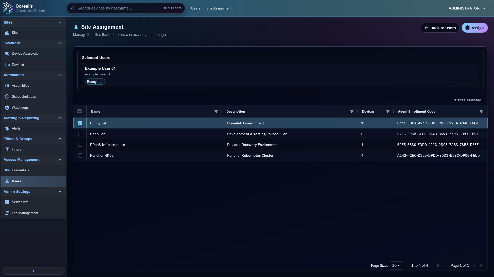

# User Management

User Management controls Borealis operator accounts, roles, MFA state, local password reset, directory cache state, and site assignment entrypoints.

<figure class="bo-screenshot">
  
  <figcaption>User site assignment controls which sites non-admin operators can see and manage.</figcaption>
</figure>

## Manage Operators

1. Open `Access Management > Users`.
2. Review display name, username, source, last login, role, MFA, and recovery state.
3. Create local users when needed.
4. Reset password or recover account for local users.
5. Change role only when operator responsibility changes.
6. Open Site Assignment for non-admin operators.

## User Sources

- `Local` users authenticate with Borealis password plus MFA, and can use passkeys after setup.
- `Directory` users authenticate through Directory Services, keep Borealis MFA, and are cached in Borealis for role/site authorization.

## MFA Handling

MFA is required by default. Admins can reset MFA for an operator. Disabling MFA is admin-only and should be rare.

## Aegis Recovery State

After Aegis force reset, affected users can show recovery required. Recovering or resetting clears stale MFA/passkey material so the operator re-enrolls cleanly.

??? example "Detailed Codex Breakdown"

    ### API endpoints

    - `GET /api/users` - list operators.
    - `POST /api/users` - create local operator.
    - `DELETE /api/users/<username>` - delete operator.
    - `POST /api/users/<username>/reset_password` - reset local password or recover account.
    - `POST /api/users/<username>/role` - update role.
    - `POST /api/users/<username>/mfa` - enable, disable, or reset MFA.
    - `POST /api/users/<username>/directory-cache` - enable or disable cached directory user.
    - `POST /api/user_site_assignments/selection` - load site assignment.
    - `POST /api/user_site_assignments/assign` - replace site assignment.

    ### Related documentation

    - [Site Assignments](site-assignments.md)
    - [Directory Services](directory-services.md)
    - [Credential Management](credential-management.md)
    - [Security and Trust](../Reference/security-and-trust.md)

    ### Source map

    - User API: `Data/Engine/Containers/api-backend/data/services/API/access_management/users.py`
    - User UI: `Data/Engine/Containers/webui-frontend/data/web-interface/src/Access_Management/Users.jsx`
    - Auth context UI: `Data/Engine/Containers/webui-frontend/data/web-interface/src/app/providers/AuthContext.jsx`

    ### Runtime behavior

    - Users live in `users`.
    - `auth_source='local'` uses Borealis password/passkey flows.
    - `auth_source='directory'` uses directory provider login and blocks local password/passkey management.
    - `auth_reset_required=1` blocks normal login until recovery clears the flag.
