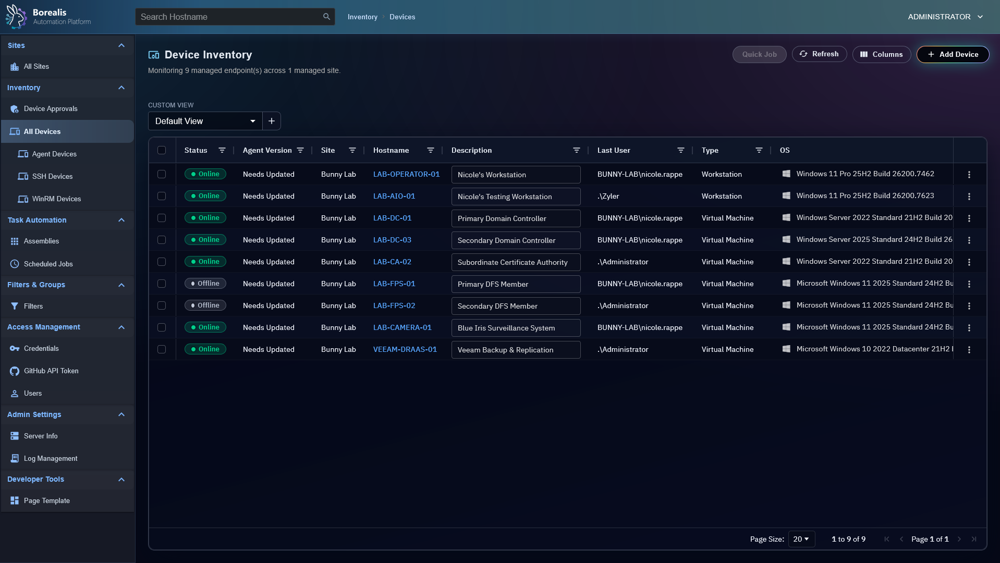

# Borealis Documentation

Borealis is a self-hosted remote management, monitoring, and visual automation platform built around a Linux-hosted management Engine and a cross-platform Agent runtime. It replaces separate homelab and real-world operations tools with one cohesive operator interface.

Borealis combines useful parts of RMM platforms, Ansible/AWX-style automation, scheduled jobs, watchdog remediation, remote desktop and interactive shell access, file/software/process/service management, and credential-backed infrastructure execution.

<figure class="bo-screenshot">
  
  <figcaption>Device List is the normal operator entrypoint for managed fleet work.</figcaption>
</figure>

## Project Status

Borealis is maintained by one person while working a full-time IT job. Progress is iterative, and some internals get reworked as better architecture emerges. Current focus is turning the automation and remote-operations core into a broader MSP-ready platform.

## Getting Started

Deploy the Borealis Engine to a Linux host:

```sh
curl -fsSL https://raw.githubusercontent.com/bunny-lab-io/Borealis/refs/heads/main/Engine.sh | sudo bash -s -- deploy prod
```

Use [Getting Started](Start%20Here/getting-started.md) for deployment flow, first-run checks, Agent setup, and operational next steps.

## Architecture

- **Engine**: Linux-hosted single-node control plane with Python services, PostgreSQL, Traefik, WebSockets, scheduling, automation, and web UI.
- **Agent**: Script-staged cross-platform runtime with Windows as reference path, Linux as partial-but-working path, role-based capabilities, signed work execution, inventory, WireGuard, remote shell, file management, and remote operation roles.
- **Transport**: Agents connect outbound. Remote operations use WireGuard sessions with strict `/32` isolation and Engine-controlled port allowlists.
- **Data Layer**: PostgreSQL stores devices, inventory, jobs, activity history, alerts, assemblies, credentials metadata, and operational state.
- **Automation Model**: Assemblies can run through quick jobs, scheduled jobs, workflows, watchdog remediation, and Engine-side Ansible playbooks.
- **Security Model**: Aegis Cipher protects secrets, MFA is required by default, passkeys are supported, scripts are signed, and WireGuard tunnel access uses short-lived tokens.

## Feature Support Matrix

Status means productized support in current Borealis codebase and docs, not long-term intent. `Full` means supported on that endpoint path today. `Partial` means useful implementation exists but gaps or validation remain. `-` means no productized endpoint support or OS scope does not apply. 

=== "Agent (Client)"

    | Feature | What it Does | Windows | Linux | macOS |
    | --- | --- | --- | --- | --- |
    | Agent Runtime | Script-staged Python Agent with role loading, enrollment, telemetry, and remote-operation roles. | Full | Full | - |
    | Inventory Collection | Collect hardware, OS, software, services, sessions, status, and health payloads from endpoint. | Full | Full | - |
    | WireGuard Tunnel | Maintain outbound WireGuard transport for remote operations and Engine-side automation reachability. | Full | Full | - |
    | Remote Shell Host | Expose interactive shell over managed WireGuard tunnel. | Full | Full | - |
    | Remote Desktop | Run endpoint-side remote desktop service used by Apache Guacamole browser sessions. | Full | - | - |
    | File Operations | Browse, upload, folder-upload, download, cancel transfers, copy, cut, paste, rename, move, delete, create folders, and edit text files remotely. | Full | Full | - |
    | Process Operations | Report live process data and accept process-control actions such as End Task. | Full | Full | - |
    | Service Operations | Report service inventory and accept start, stop, and restart actions. | Full | Full | - |
    | Software Operations | Report installed software, refresh inventory, and support software-management actions. | Full | Full | - |
    | Signed Script Execution | Validate signed payloads and run scripts in supported contexts. | Full | Full | - |
    | Watchdog Inputs and Remediation | Provide endpoint telemetry used by watchdogs and execute remediation assemblies when dispatched. | Full | Full | - |
    | Device Identity and Tunnel Trust | Use Ed25519 device identity, short-lived tunnel tokens, and public CA/hostname validation. | Full | Full | - |

=== "Engine (Server)"

    | Feature | What it Does |
    | --- | --- |
    | Device Inventory Store | Store device inventory, status, health, software, services, sessions, and activity history in PostgreSQL. |
    | Sites, Agent Approvals, and RBAC | Scope devices by site, approve agent enrollments, and restrict operators by site. |
    | Device Filters | Build typed filters, preview matches, scope automations by site, and save per-operator device-list views. |
    | Remote Operations API and UI | Provide operator-facing APIs and UI for shell, desktop, files, processes, services, and software actions. |
    | Scheduled and Quick Jobs | Dispatch signed scripts, workflows, and Engine-side Ansible playbook runs with target history. |
    | Workflow Editor | Build and run graph-based automation from web UI. |
    | Watchdogs and Auto-Remediation | Preview watchdog matches, track incidents, suppress noise, and dispatch remediation automations. |
    | Aurora Content Repository | Ingest official assemblies, scripts, and playbooks while keeping local user assemblies on Engine. |
    | Engine-side Ansible | Run SSH or WinRM automation from Linux Engine over Borealis-managed WireGuard sessions. |
    | Aegis Cipher | Protect reusable machine credentials, operator password hashes, TOTP secrets, passkey data, and GitHub token storage with `scrypt` plus `AES-256-GCM`. |
    | MFA, Passkeys, and Sessions | Require Aegis unlock, enforce MFA by default, support WebAuthn passkeys, and invalidate sessions strictly. |
    | Code Signing | Sign script delivery and enforce trusted execution payloads. |
    | REST/API Surface | Expose authenticated APIs for devices, jobs, files, processes, services, software, filters, sites, logs, and runtime operations. |
    | Reporting | Track device activity history, scheduled job run history, alerts, and ansible recap data. |

## Engine Deployment Profiles

Engine container deployment uses conservative defaults from `Engine/Deploy/compose.env`. Sizing below is planning guidance; tune database pool and PostgreSQL settings explicitly for larger installations.

=== "Homelab"
    | Typical use | Endpoints | Active operators | vCPU | RAM | NVMe storage |
    | --- | ---: | ---: | ---: | ---: | ---: |
    | Personal labs, testing, feature development, very small sites | Up to 250 | 1-3 | < 8 | < 16 GiB | 80-150 GiB |

=== "Small Business"
    | Typical use | Endpoints | Active operators | vCPU | RAM | NVMe storage |
    | --- | ---: | ---: | ---: | ---: | ---: |
    | Smaller production environments | Up to 1,000 | 2-4 | 8-15 | 16-31 GiB | 150-250 GiB |

 === "MSP"
    | Typical use | Endpoints | Active operators | vCPU | RAM | NVMe storage |
    | --- | ---: | ---: | ---: | ---: | ---: |
    | Main Borealis target for SMB and managed-service usage | Up to 2,000 | 4-8 | 16-23 | 32-63 GiB | 500 GiB |

 === "Enterprise"
    | Typical use | Endpoints | Active operators | vCPU | RAM | NVMe storage |
    | --- | ---: | ---: | ---: | ---: | ---: |
    | Larger single-node environments on current architecture | Up to 10,000 | 10-20 | 24+ | 64 GiB+ | 500 GiB-1 TiB |

 === "Enterprise Clustered"
    | Typical use | Endpoints | Active operators | vCPU | RAM | NVMe storage |
    | --- | ---: | ---: | ---: | ---: | ---: |    
    | Roadmap-only multi-node planning placeholder | 10,000+ | 20+ per node | 24+ per node | 64 GiB+ per node | 500 GiB-1 TiB per node |

## Choose Starting Point

<div class="bo-card-grid" markdown>

<div class="bo-card" markdown>
**New Operators**

[Getting Started](Start%20Here/getting-started.md) covers Engine bootstrap, optional Agent install, and first-run checks.
</div>

<div class="bo-card" markdown>
**Runtime Maintainers**

[Architecture Overview](Start%20Here/architecture-overview.md), [Engine Runtime](Core%20Runtimes/engine-runtime.md), and [Agent Runtime](Core%20Runtimes/agent-runtime.md) explain system shape.
</div>

<div class="bo-card" markdown>
**Fleet Operations**

[Device Management](Operations%20and%20Remote%20Access/device-management.md), [Device Alerts](Operations%20and%20Remote%20Access/device-alerts.md), and [Logging and Operations](Operations%20and%20Remote%20Access/logging-and-operations.md) cover daily operator workflows.
</div>

<div class="bo-card" markdown>
**Automation Authors**

[Assemblies and Quick Jobs](Automation%20and%20Execution/assemblies.md), [Flow Editor and Nodes](Automation%20and%20Execution/flow-editor-and-nodes.md), and [Scheduled Jobs](Automation%20and%20Execution/scheduled-jobs.md) cover automation design and execution.
</div>

<div class="bo-card" markdown>
**Remote Support**

[VPN and Remote Access](Operations%20and%20Remote%20Access/vpn-and-remote-access.md) covers WireGuard tunnels, Remote PowerShell, and browser VNC.
</div>

<div class="bo-card" markdown>
**Contributors**

[Unit Testing](Start%20Here/Unit_Testing.md), [API Reference](Data%20and%20Schema/api-reference.md), and [Database Reference](Data%20and%20Schema/db-reference.md) define validation and shared contracts.
</div>

</div>

## Documentation Map

- [Start Here](Start%20Here/index.md) - install path, architecture, security, UI rules, and testing entrypoints.
- [Screenshots](Start%20Here/screenshots.md) - visual tour of Borealis operator surfaces.
- [Operations](Operations%20and%20Remote%20Access/index.md) - device inventory, alerts, remote access, logs, and software management.
- [Automation](Automation%20and%20Execution/index.md) - assemblies, flows, scheduled jobs, SSH logic, and watchdogs.
- [Reference](Core%20Runtimes/index.md) - runtime, Docker stack, API, database, integration, and SBOM references.
- [Development](Start%20Here/Unit_Testing.md) - testing and migration guidance.
- [Roadmap](Future_Roadmaps/index.md) - competitive gaps and roadmap pressure.

## Repository References

- [README](https://github.com/bunny-lab-io/Borealis/blob/main/README.md)
- [AGENTS.md](https://github.com/bunny-lab-io/Borealis/blob/main/AGENTS.md)
- [Engine Unit Test Script](https://github.com/bunny-lab-io/Borealis/blob/main/Engine_Unit_Tests.sh)
- [Linux Agent Unit Test Script](https://github.com/bunny-lab-io/Borealis/blob/main/Data/Agent/Unit_Tests/Agent_Unit_Tests.sh)
- [Windows Agent Unit Test Script](https://github.com/bunny-lab-io/Borealis/blob/main/Data/Agent/Unit_Tests/Agent_Unit_Tests.ps1)
- [Technical Debt issues](https://github.com/bunny-lab-io/Borealis/issues?q=is%3Aissue%20label%3A%22Technical%20Debt%22)

??? example "Detailed Codex Breakdown"

    Start with `AGENTS.md` at the repo root, then use this documentation site as the knowledgebase entrypoint.

    Runtime source locations:

    - Engine package shim and tests: `Data/Engine/`.
    - Engine API source code: `Data/Engine/Containers/api-backend/data/`.
    - Agent source code: `Data/Agent/`.
    - Web UI source: `Data/Engine/Containers/webui-frontend/data/web-interface/src/`.
    - Runtime copies: `Engine/` and `Agent/`; do not edit directly.
    - Logs: `Engine/Services/api-backend/logs/` and `Agent/Logs/`.

    Authoring rules:

    - Keep new documentation inside closest domain folder.
    - Add public pages to `../zensical.toml` navigation.
    - Use ASCII unless existing file already uses Unicode.
    - Avoid duplicating long source code; link to files and summarize behavior.
    - Document UI and backend components together when both change.
    - Keep screenshots on [Screenshots](Start%20Here/screenshots.md) by default. Landing pages may carry one high-signal screenshot; topic pages should stay screenshot-free unless an operator intentionally adds one.
    - Put Codex-only guidance at the end of each page in `??? example "Detailed Codex Breakdown"`.
    - Use GitHub issues labeled `Technical Debt` for workarounds, non-standard build steps, or dev/prod drift.
