# Screenshots

Browse Borealis screens from one page. Individual docs stay focused on behavior and implementation details; this page carries visual context.

## Fleet And Inventory

<figure class="bo-screenshot">
  
  <figcaption>Device Inventory is the primary fleet view, showing managed endpoints, site assignment, status, user, type, and operating system.</figcaption>
</figure>

<figure class="bo-screenshot">
  
  <figcaption>Device Summary centralizes inventory, remote actions, service state, software data, and device-specific workflows.</figcaption>
</figure>

<figure class="bo-screenshot">
  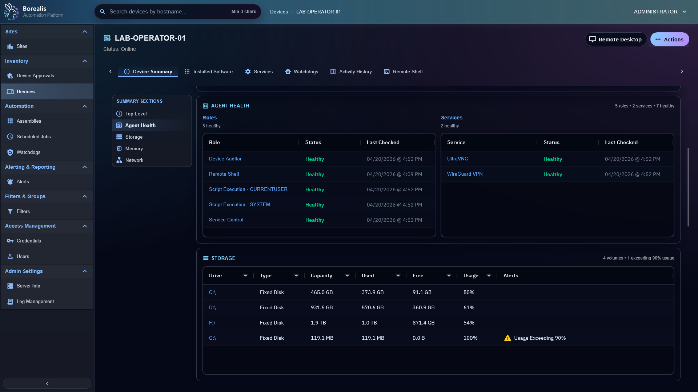
  <figcaption>Agent Health shows startup and role telemetry so operators can see where an endpoint is healthy, pending, skipped, or failed.</figcaption>
</figure>

<figure class="bo-screenshot">
  
  <figcaption>Device Approval Queue holds enrollment requests until an authorized operator approves or rejects them.</figcaption>
</figure>

<figure class="bo-screenshot">
  
  <figcaption>Sites group devices for enrollment, operator visibility, targeting, and organization.</figcaption>
</figure>

<figure class="bo-screenshot">
  
  <figcaption>User site assignment controls which sites non-admin operators can see and manage.</figcaption>
</figure>

<figure class="bo-screenshot">
  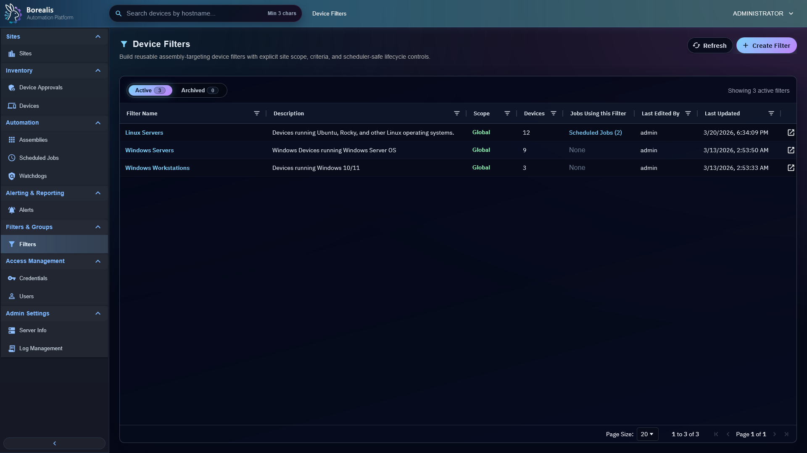
  <figcaption>Device filters create reusable dynamic target sets for views, jobs, and watchdog policy scope.</figcaption>
</figure>

<figure class="bo-screenshot">
  
  <figcaption>Device Filter Editor defines criteria and site scope for dynamic endpoint matching.</figcaption>
</figure>

<figure class="bo-screenshot">
  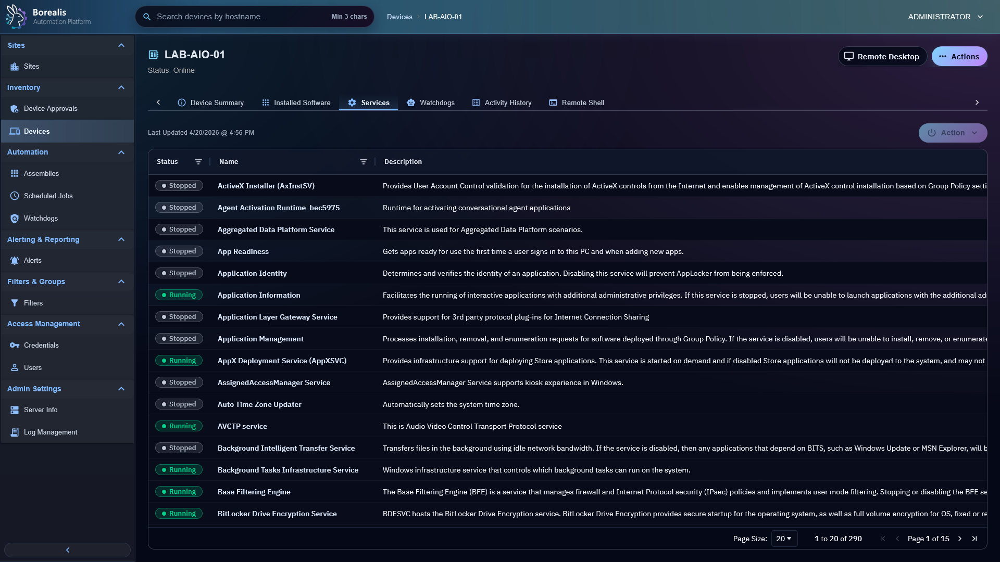
  <figcaption>Service inventory shows cached service state and supports service management actions for devices.</figcaption>
</figure>

<figure class="bo-screenshot">
  
  <figcaption>Process Manager provides task-manager style process inspection, resource columns, and operator actions.</figcaption>
</figure>

<figure class="bo-screenshot">
  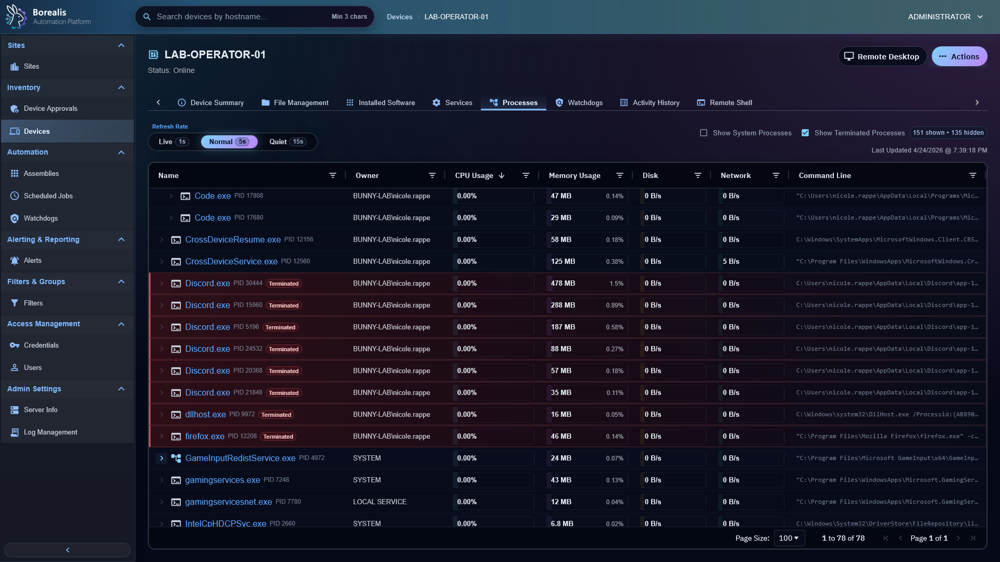
  <figcaption>Terminated task visibility keeps recent process exits visible after an End Task action or live polling update.</figcaption>
</figure>

## Remote Access

<figure class="bo-screenshot">
  
  <figcaption>Remote Desktop uses browser VNC through Guacamole over the managed WireGuard tunnel.</figcaption>
</figure>

<figure class="bo-screenshot">
  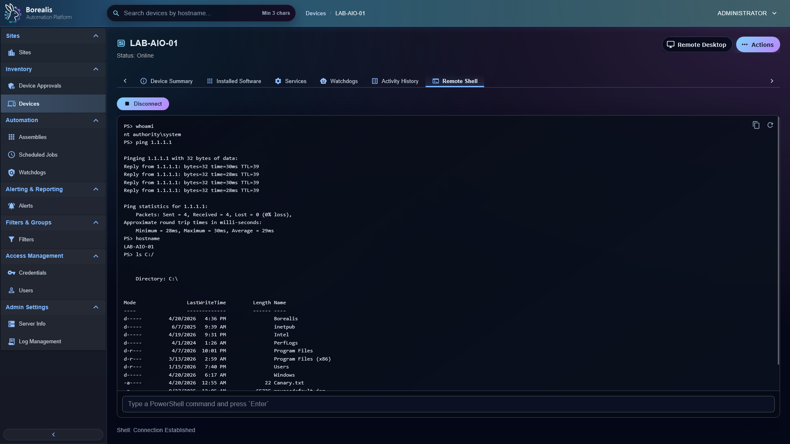
  <figcaption>Remote Shell bridges operator shell sessions to the agent over the same persistent tunnel path.</figcaption>
</figure>

<figure class="bo-screenshot">
  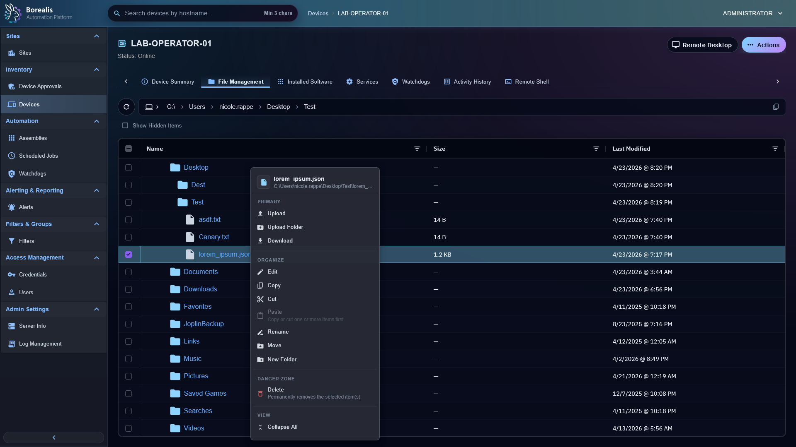
  <figcaption>File Management supports remote browse, upload, download, edit, rename, move, and delete workflows.</figcaption>
</figure>

## Automation

<figure class="bo-screenshot">
  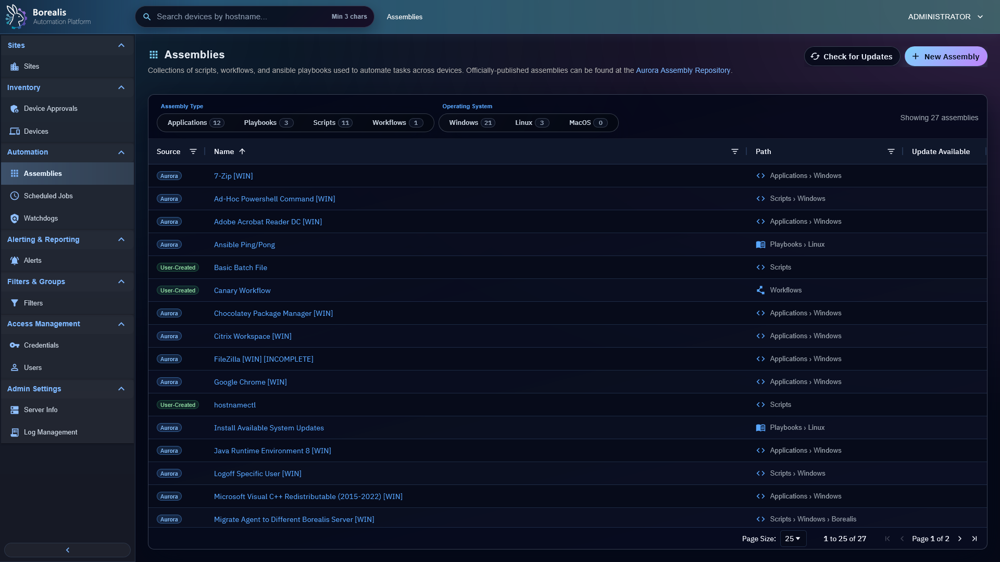
  <figcaption>Assembly List is the catalog for script assemblies, playbooks, and workflow-backed automation.</figcaption>
</figure>

<figure class="bo-screenshot">
  
  <figcaption>Assembly Editor captures reusable automation payloads, metadata, variables, and execution settings.</figcaption>
</figure>

<figure class="bo-screenshot">
  
  <figcaption>Workflow Editor composes automation through visual nodes, typed ports, and routed connections.</figcaption>
</figure>

<figure class="bo-screenshot">
  
  <figcaption>Scheduled Job List shows recurring automation, onboarding jobs, status, cadence, and recent results.</figcaption>
</figure>

<figure class="bo-screenshot">
  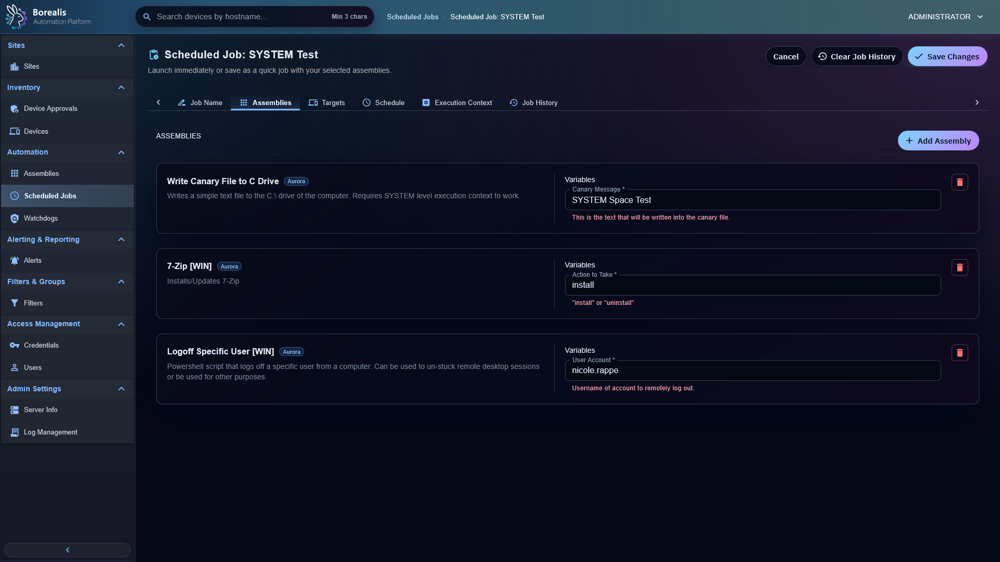
  <figcaption>Scheduled Job Editor binds assemblies to targets, schedules, execution context, and variables.</figcaption>
</figure>

<figure class="bo-screenshot">
  
  <figcaption>Scheduled Job History preserves run-level and target-level outcomes for troubleshooting.</figcaption>
</figure>

<figure class="bo-screenshot">
  
  <figcaption>Ansible recaps expose Engine-side playbook execution output and per-target status.</figcaption>
</figure>

<figure class="bo-screenshot">
  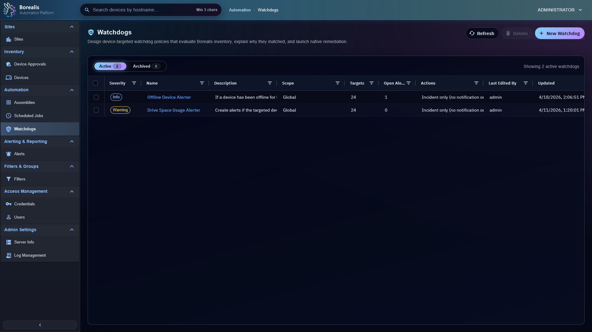
  <figcaption>Watchdogs define monitoring rules, site scope, target sets, incident policy, and remediation actions.</figcaption>
</figure>

<figure class="bo-screenshot">
  
  <figcaption>Alerts queue displays open, suppressed, and resolved incidents produced by watchdog evaluation.</figcaption>
</figure>

## Software Management

<figure class="bo-screenshot">
  
  <figcaption>Installed Software shows per-device package state and software actions.</figcaption>
</figure>

<figure class="bo-screenshot">
  
  <figcaption>Software Audit helps operators compare and review software state across devices.</figcaption>
</figure>

## Administration And Security

<figure class="bo-screenshot">
  
  <figcaption>Server Overview summarizes Engine runtime state, services, access, resources, WireGuard, and Aegis status.</figcaption>
</figure>

<figure class="bo-screenshot">
  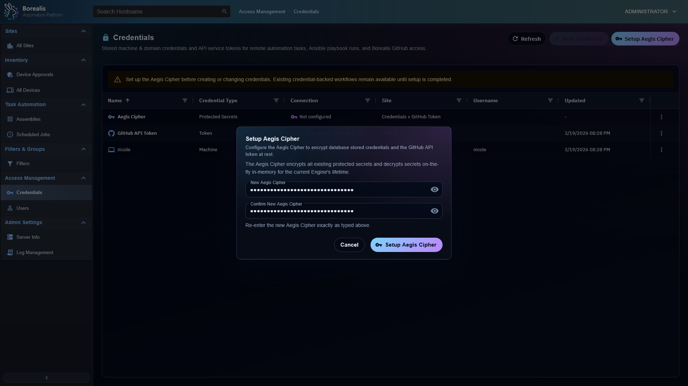
  <figcaption>Aegis Cipher gates operator access and protects sensitive credentials at rest.</figcaption>
</figure>

<figure class="bo-screenshot">
  
  <figcaption>Credential Management stores reusable credentials for onboarding, remote access, and automation workflows.</figcaption>
</figure>

<figure class="bo-screenshot">
  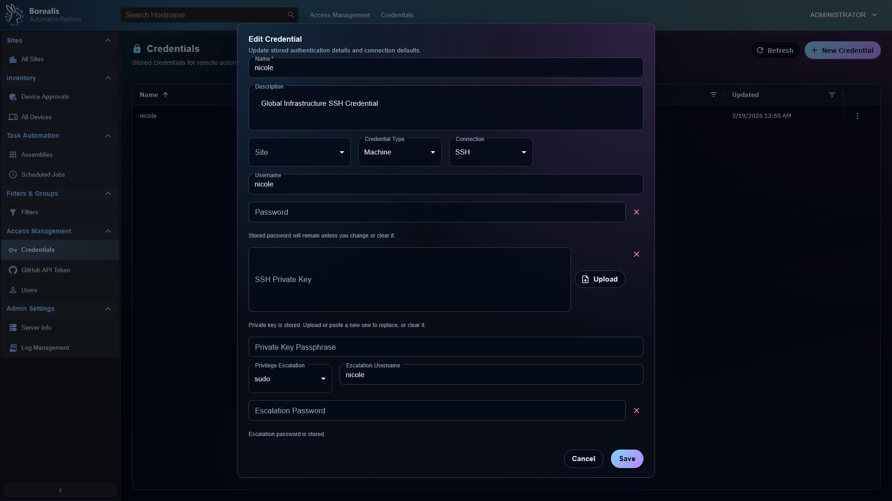
  <figcaption>Credential editor captures secret material and connection metadata behind Borealis authorization controls.</figcaption>
</figure>

<figure class="bo-screenshot">
  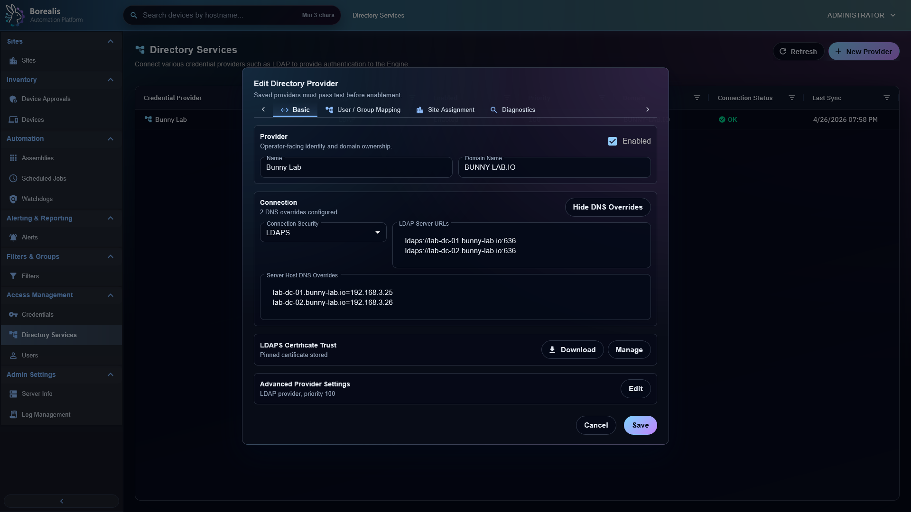
  <figcaption>Directory Services configures external identity providers and directory authentication behavior.</figcaption>
</figure>

## Logs And Local Agent

<figure class="bo-screenshot">
  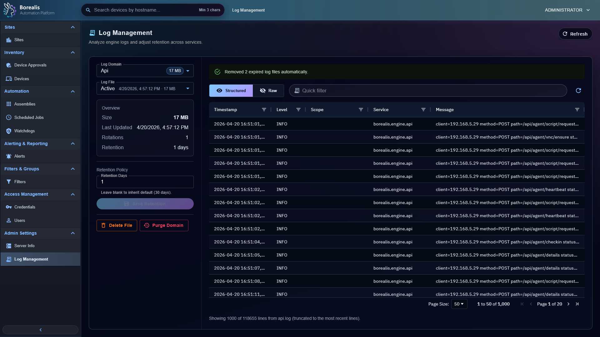
  <figcaption>Log Management provides filtered access to Engine and service logs from the WebUI.</figcaption>
</figure>

<figure class="bo-screenshot">
  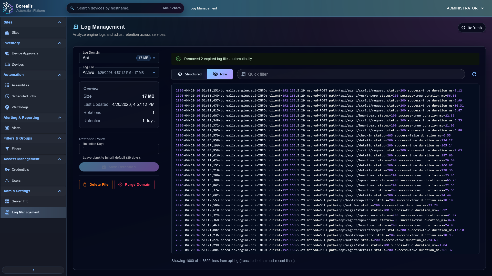
  <figcaption>Raw log view exposes detailed log contents for focused troubleshooting.</figcaption>
</figure>

<figure class="bo-screenshot">
  
  <figcaption>Agent system tray gives local users and support staff a device-side status surface.</figcaption>
</figure>
