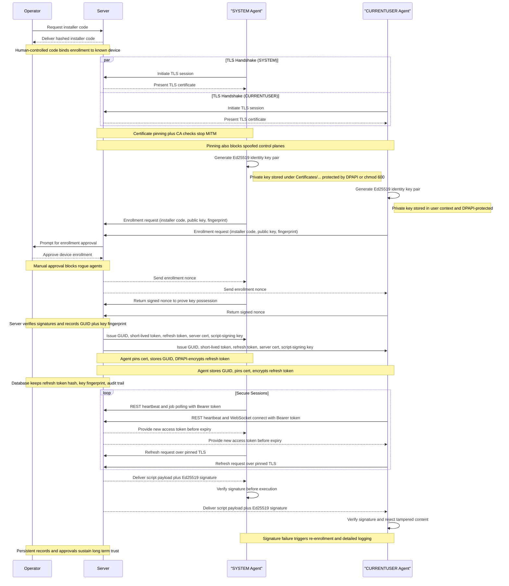
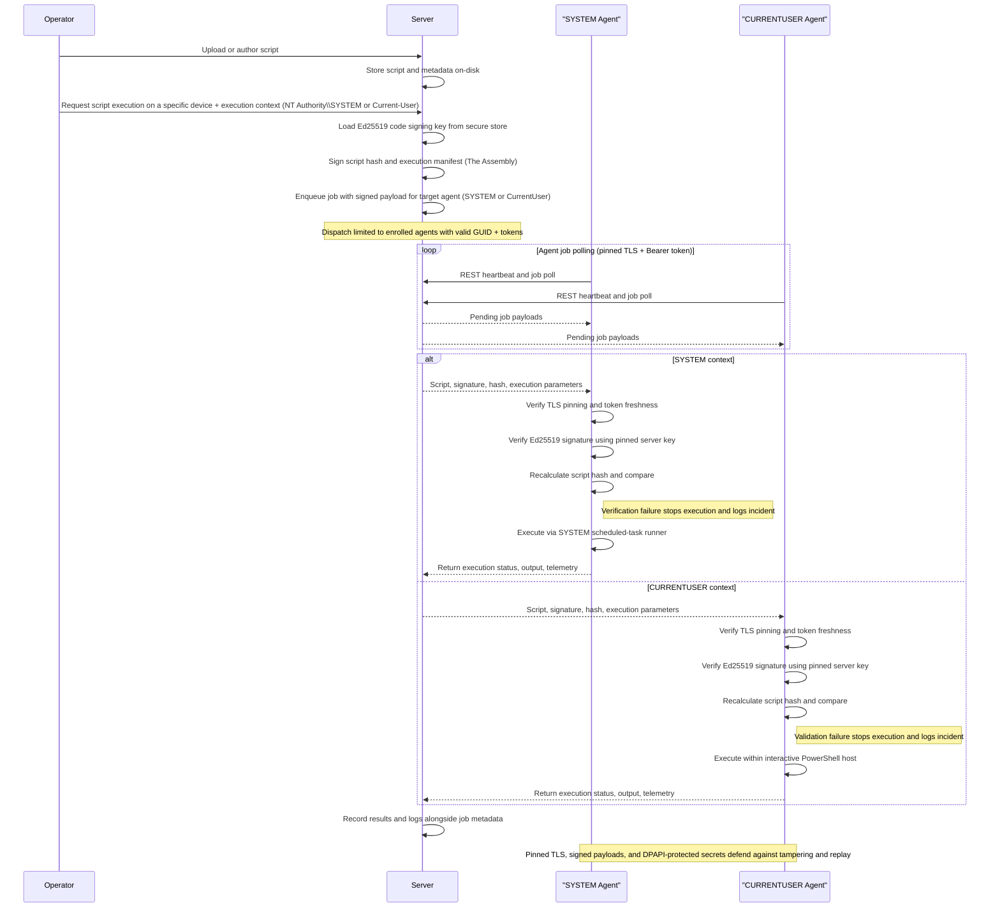

# Security and Trust
[Back to Docs Index](index.md) | [Index (HTML)](index.html)

## Purpose
Explain the Borealis trust model, enrollment security, token handling, and code signing behavior.

## Security Model Summary
- Mutual trust: each agent has a unique Ed25519 identity key; the Engine issues Ed25519-signed access tokens bound to that fingerprint.
- Pinned TLS: the Engine generates a root + leaf chain and agents pin the bundle for REST and Socket.IO traffic.
- Short-lived access tokens: JWTs signed with Ed25519, default lifetime about 15 minutes.
- Long-lived refresh tokens: 90-day sliding window, hashed in the Engine database.
- Code signing: scripts are signed by the Engine; agents reject payloads with invalid signatures.

## Security Breakdown (Full)
### Overall
- Borealis enforces mutual trust: each agent presents a unique Ed25519 identity to the server, the server issues EdDSA-signed (Ed25519) access tokens bound to that fingerprint, and both sides pin the generated Borealis root CA.
- End-to-end TLS everywhere: the Engine auto-provisions an ECDSA P-384 root + leaf chain under `Engine/Certificates` and serves TLS using Python defaults (TLS 1.2+); agents pin the delivered bundle for both REST and WebSocket traffic to eliminate man-in-the-middle avenues.
- Device enrollment is gated by enrollment and installer codes (configurable expiration and usage limits) and an operator approval queue; replay-resistant nonces plus rate limits (40 req/min/IP, 12 req/min/fingerprint) prevent brute force or code reuse.
- All device APIs require Authorization: Bearer headers and a service-context marker (SYSTEM or CURRENTUSER); missing, expired, mismatched, or revoked credentials are rejected before any business logic runs. Operator-driven revoking and device quarantining are not yet implemented.
- Replay and credential theft defenses layer in DPoP proof validation (thumbprint binding) on the server side and short-lived access tokens (about 15 minutes) with 90-day refresh tokens hashed via SHA-256.
- Centralized logging under `Engine/Logs` and `Agent/Logs` captures enrollment approvals, rate-limit hits, signature failures, and auth anomalies for post-incident review.
- Operator-facing API endpoints (device inventory, assemblies, job history, etc.) require an authenticated operator session or bearer token; unauthenticated requests are rejected with 401/403 responses before any inventory or script metadata is returned and the requesting user is logged with each quick-run dispatch.

### Server Security
- Auto-manages PKI: a persistent Borealis root CA (ECDSA SECP384R1) signs leaf certificates that include localhost SANs, tightened filesystem permissions, and a combined bundle for agent identity and cert pinning.
- Script delivery is code-signed with an Ed25519 key stored under `Engine/Certificates/Code-Signing`; agents refuse any payload whose signature does not match the pinned public key.
- Device authentication checks GUID normalization, SSL fingerprint matches, token version counters, and quarantine flags before admitting requests; missing rows with valid tokens auto-recover into placeholder records to avoid accidental lockouts.
- Refresh tokens are never stored in cleartext; only SHA-256 hashes plus DPoP bindings are stored in SQLite, and reuse after revocation/expiry returns explicit error codes.
- Enrollment workflow queues approvals, detects hostname and fingerprint conflicts, offers merge/overwrite options, and records auditor identities so trust decisions are traceable.
- Background pruning of expired enrollment codes and refresh tokens is not wired yet; a maintenance task is still needed.

### Agent
- Generates device-wide Ed25519 key pairs on first launch, storing them under `Certificates/Agent/Identity/` with DPAPI protection on Windows (chmod 600 elsewhere) and persisting the server-issued GUID alongside.
- Stores refresh/access tokens encrypted (DPAPI) and re-enrolls on authentication failures; TLS pinning relies on the stored server certificate bundle rather than a separate fingerprint binding for the tokens.
- Imports the server TLS bundle into a dedicated `ssl.SSLContext`, reuses it for the REST session, and injects it into the Socket.IO engine so WebSockets enjoy the same pinning and hostname checks.
- Treats every script payload as hostile until verified: only Ed25519 signatures from the server are accepted, missing or invalid signatures are logged and dropped, and the trusted signing key is updated only after successful verification between the agent and the server.
- Operates outbound-only; there are no listener ports, and every API/WebSocket call flows through `AgentHttpClient.ensure_authenticated`, forcing token refresh logic before retrying.
- Logs bootstrap, enrollment, token refresh, and signature events to daily-rotated files under `Agent/Logs`, giving operators visibility without leaking secrets outside the project root.

### WireGuard Agent to Engine Tunnels
- Borealis started with a bespoke reverse tunnel stack (WebSocket framing + domain lanes); its handshake and security model did not scale, so the project moved to WireGuard as the Engine <-> Agent data pipeline for secure remote protocols and future remote desktop control.
- On-demand, outbound-only: operators trigger a tunnel start, the agent dials the Engine (no inbound listeners), and the tunnel tears down on stop or idle.
- Shared sessions: one live VPN tunnel per agent, reused across operators to avoid redundant connections.
- Fast and robust transport: WireGuard provides encrypted UDP transport with lightweight handshakes that keep latency low and reconnects resilient.
- Orchestration security: the Engine issues short-lived, Ed25519-signed tunnel tokens that the agent verifies before bringing the tunnel up.
- Pinned trust: tunnel orchestration uses the same pinned TLS channel as REST and Socket.IO to prevent MITM during setup and control.
- Isolation by default: each agent gets a host-only /32; AllowedIPs are restricted to the agent /32 and the Engine /32; no LAN routes and no client-to-client traffic.
- Port-level controls: per-device allowlists plus Engine-applied firewall rules limit which protocols can traverse the tunnel.
- Live PowerShell today: a VPN-only shell endpoint enables remote command execution with SYSTEM-level (`NT AUTHORITY\\SYSTEM`) access for deep diagnostics and remediation.
- Session lifecycle: 15-minute idle timeout with no grace period; session material includes a virtual IP plus allowed ports; teardown removes the tunnel and firewall rules.
- Future protocols: extend the same tunnel for SSH, WinRM, RDP, VNC, WebRTC streaming, and other remote management workflows by enabling ports per device.

## Enrollment and Identity
- Enrollment uses install codes and operator approval.
- The agent generates its Ed25519 key pair locally and proves possession via signed nonces.
- Engine returns GUID, access token, refresh token, TLS bundle, and script signing key.

## Token and DPoP Handling
- Access tokens are required on device APIs (Bearer token).
- Refresh tokens are stored encrypted on the agent and hashed on the Engine.
- DPoP proof headers bind refresh tokens to a key thumbprint and prevent replay.

## Code Signing
- Engine signs script payloads using `Engine/Certificates/Code-Signing` keys.
- Agent verifies signatures before execution; failures are logged and rejected.

## Automated Agent Enrollment
If you deploy the agent via Group Policy or another automation platform, you can pre-inject an enrollment code during install. The enrollment code below is an example only.

**Windows**:
```powershell
.\Borealis.ps1 -Agent -EnrollmentCode "E925-448B-626D-D595-5A0F-FB24-B4D6-6983"
```
**Linux**: Agent enrollment is not yet available on Linux; `Borealis.sh --Agent` only writes settings placeholders.

## Agent/Server Enrollment (Sequence Diagram)


## Code-Signed Remote Script Execution (Sequence Diagram)


## API Endpoints
- `POST /api/agent/enroll/request` (No Authentication) - start enrollment.
- `POST /api/agent/enroll/poll` (No Authentication) - finalize enrollment after approval.
- `POST /api/agent/token/refresh` (Refresh Token) - mint a new access token.
- `POST /api/auth/login` (No Authentication) - operator login.
- `POST /api/auth/logout` (Token Authenticated) - operator logout.
- `POST /api/auth/mfa/verify` (Token Authenticated, MFA pending) - verify MFA.
- `GET /api/auth/me` (Token Authenticated) - current operator profile.
- `GET /api/admin/enrollment-codes` (Admin) - list install codes.
- `POST /api/admin/enrollment-codes` (Admin) - create install codes.
- `DELETE /api/admin/enrollment-codes/<code_id>` (Admin) - delete install codes.

## Related Documentation
- [Agent Runtime](agent-runtime.md)
- [Engine Runtime](engine-runtime.md)
- [Device Management](device-management.md)
- [API Reference](api-reference.md)

## Codex Agent (Detailed)
### Key material locations (Engine)
- TLS certificate: `Engine/Certificates/borealis-server-cert.pem`.
- TLS private key: `Engine/Certificates/borealis-server-key.pem`.
- TLS bundle (CA + server): `Engine/Certificates/borealis-server-bundle.pem`.
- Root CA key: `Engine/Certificates/borealis-root-ca-key.pem`.
- Script signing keys: `Engine/Certificates/Code-Signing/borealis-script-ed25519.key` and `.pub`.

### Key material locations (Agent)
- Identity keys: `Certificates/Agent/Identity/agent_identity_private.ed25519` and `agent_identity_public.ed25519`.
- Trusted server bundle: `Certificates/Agent/Trusted_Server_Cert/` (scope-specific).
- Tokens and GUID: `Agent/Borealis/Settings/` (refresh.token, access.jwt, Agent_GUID.txt).

### Enrollment sequence (step-by-step)
1) Agent generates Ed25519 key pair and a fingerprint.
2) Agent submits `/api/agent/enroll/request` with install code and public key.
3) Engine rate-limits and queues for operator approval.
4) Operator approves via `/api/admin/device-approvals/<id>/approve`.
5) Agent polls `/api/agent/enroll/poll`, returns signed nonce.
6) Engine issues GUID, access token, refresh token, TLS bundle, and signing key.
7) Agent pins cert bundle and stores tokens securely.

### Access vs refresh tokens
- Access token (JWT, EdDSA): used on every device API call; default expiry about 900 seconds.
- Refresh token: used only on `/api/agent/token/refresh` to mint new access tokens.
- Refresh token is SHA-256 hashed in DB and never stored in plaintext by the Engine.

### DPoP binding
- Refresh token requests can include a `DPoP` header.
- Engine validates DPoP proof and stores `dpop_jkt` in `refresh_tokens` table.
- Replay attempts return `dpop_replayed` and force re-enrollment behavior.

### Rate limiting and abuse controls
- Enrollment uses IP and fingerprint rate limiters (see `Data/Engine/services/API/enrollment/routes.py`).
- README documents IP and fingerprint rate limits (40 req/min/IP, 12 req/min/fingerprint).

### Code signing behavior
- Engine signs script payload bytes (Ed25519) before dispatch.
- Agent verifies signatures with `signature_utils` and stores the signing key on first success.
- If verification fails, the script is rejected and the agent logs an incident.

### Common failure modes
- `fingerprint_mismatch`: agent identity changed or cert data was wiped.
- `token_version_mismatch`: device token version bumped or revoked.
- `refresh_token_expired`: agent offline too long (greater than 90 days without refresh).
- `dpop_invalid`: DPoP proof missing or malformed.

### Agent Refresh Tokens (Full)
#### What a refresh token is
- A long-lived credential the agent gets during enrollment; it represents device trust and is bound to the agent's key/certificate fingerprint.
- Stored locally under the agent settings directory as an encrypted blob (`refresh.token`) alongside token metadata (`access.meta.json`) and the agent GUID.
- Not presented to normal APIs; it is only sent to the Engine to mint new short-lived access tokens.

#### How the agent obtains it
1) Enrollment (`/api/agent/enroll/request` -> `/api/agent/enroll/poll`):
   - The agent proves possession of its Ed25519 identity and an operator-approved enrollment code.
   - The Engine issues:
     - `guid` (device identity)
     - `access_token` (EdDSA JWT, about 15 minutes)
     - `refresh_token` (random urlsafe string)
     - Engine TLS bundle and signing key
   - The agent persists the GUID, access token, refresh token, and expiry metadata via `AgentKeyStore` (`Data/Agent/security.py`).

#### How long it lasts (sliding expiry)
- Base TTL: 90 days (Engine stores `expires_at = now + 90 days`).
- Sliding refresh: every successful call to `/api/agent/token/refresh` resets `expires_at` to `now + 90 days`.
- Expiry is enforced by the Engine clock, not the agent.

#### Access tokens vs refresh tokens
- Access tokens: EdDSA JWTs with a about 15 minute lifetime (default `expires_in = 900`). Used for all device API calls and Socket.IO auth.
- Refresh tokens: used only to obtain new access tokens. If missing or invalid, the agent re-enrolls.

#### How the agent uses it
- All authenticated calls pass through `AgentHttpClient.ensure_authenticated()` (`Data/Agent/agent.py`).
- If no GUID/refresh token, the agent triggers enrollment.
- If the access token is missing or near expiry, the agent posts `{guid, refresh_token}` to `/api/agent/token/refresh`.
- On success, it stores the new access token and updated expiry metadata.

#### When it stops working
- Engine-side expiry: `refresh_token_expired` (401) forces re-enrollment.
- Revocation: device status `revoked` or `decommissioned` blocks refresh.
- Fingerprint mismatch: identity key changes cause the Engine to reject refresh.
- Token version mismatch: token version bump in DB forces re-enrollment.

#### Operational notes
- Short outages are tolerated: the 90-day sliding window resets on the first successful refresh after the Engine is back.
- Long inactivity (more than 90 days without refresh) requires re-enrollment; the agent will reuse the last installer code if available, otherwise operator action is needed.
- Logs for token activity live under `Agent/Logs/` (`agent.log`, `agent.error.log`). Engine-side changes are recorded in the Engine DB `refresh_tokens` table with `last_used_at` and `expires_at`.

#### Relevant files
- Agent token lifecycle: `Data/Agent/agent.py` (`AgentHttpClient`).
- Token storage: `Data/Agent/security.py` (`AgentKeyStore`).
- Refresh API: `Data/Engine/services/API/tokens/routes.py`.
- Enrollment API: `Data/Engine/services/API/enrollment/routes.py`.
- JWT issuance: `Data/Engine/auth/jwt_service.py`.
- Database schema: `Data/Engine/database_migrations.py` (`refresh_tokens` table).

### Where to update docs when security changes
- Update this page and any impacted runtime docs (engine or agent).
- Update `api-reference.md` if you add or change security-related endpoints.
