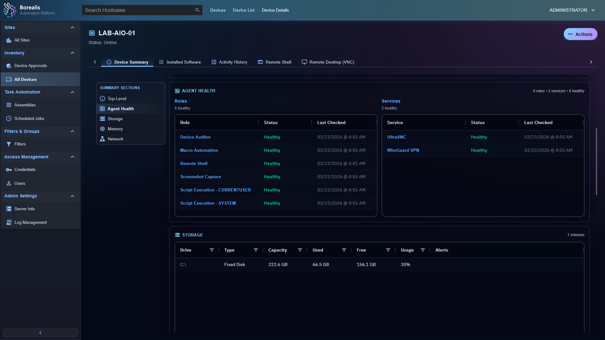

Borealis is a cross-platform remote management and automation platform with a visual workflow layer, enabling operators to execute scripts, orchestrate infrastructure tasks, and manage distributed systems through a unified interface.

The project was originally created to consolidate the functionality of multiple standalone tools used in my homelab and real-world environments (TacticalRMM, Ansible AWX, SemaphoreUI, etc.) into a single, cohesive platform.

## A Note on Development Pace
I'm the sole maintainer and still learning as I go while working a full-time IT job. Progress is iterative, and parts of the system are occasionally reworked as better architectural approaches emerge.

---

## Documentation
- Human-friendly docs live in `Docs/` with a top-level index at `Docs/index.md`
- The same files also include **Codex Agent** sections with deeper implementation details
- Start with:
  - `Docs/getting-started.md`
  - `Docs/architecture-overview.md`

---

# Core Architecture

## Secure Connectivity (WireGuard)
Borealis uses **WireGuard-based tunnels** as its primary transport layer between the Engine (*Server*) and Agents (*Clients*), and serves as the foundation for all remote operations.

- Outbound-only agent connections (no inbound exposure)
- Persistent, low-overhead tunnels with keepalive
- Shared tunnel sessions per agent
- Strict isolation (`/32` addressing, no lateral movement)
- Port-level allowlists enforced by the Engine
- Ed25519-signed, short-lived tunnel tokens
- Pinned TLS for orchestration channel security

---

## Data Layer (PostgreSQL)
Borealis now runs on **PostgreSQL**, replacing SQLite that was used in older versions of Borealis:

- Improved scalability and concurrency
- Stronger data integrity guarantees
- Foundation for larger environments and higher workloads

---

## Assembly & Automation Model
- Assemblies are stored directly in the database
- Jobs resolve assemblies by GUID
- Supports:
  - Quick Jobs
  - Scheduled Jobs
  - Workflow-based Automation (Experimental)

---

## Aurora Repository Integration
Borealis integrates with the **[Aurora Repository](https://github.com/bunny-lab-io/Aurora)**:

- Aurora serves as the external source of truth for official assemblies, scripts, and playbooks
- Decouples automation content from engine releases
- Supports update ingestion into PostgreSQL
- User-created assemblies remain local to the Engine

---

# Features

## Device Management
- Device inventory (OS, hardware, status)
- Site-based organization and filtering
- Approval workflows
- Global hostname search (RBAC-aware)

## Remote Execution
- PowerShell (Windows)
- Batch (Windows)
- Bash (Linux)
- SYSTEM-level execution support
- CURRENTUSER-level execution support

## Remote Access
- WireGuard-backed secure connectivity
- Remote Shell (cross-platform)
- Web-based VNC remote desktop (UltraVNC for Windows)
- Future support for WinRM and other protocols

## Automation & Workflows
- Quick Jobs for immediate execution
- Scheduled Jobs with improved reliability and real failure reporting
- Visual node-based workflow editor (Experimental)
- Assembly-driven execution model

## Ansible Integration
- Engine-side Ansible playbook execution
- Supports:
  - `ssh`
  - `winrm`
- Routed over Borealis WireGuard tunnels
- Integrated credential selection
- Recap/output surfaced in job history StdOut / StdErr

## Credential Management (Aegis Cipher)
- Encrypted secret storage (AES-256-GCM)
- Engine-wide unlock mechanism
- Supports:
  - Passwords
  - Private keys
  - Tokens (including GitHub API)
- Features:
  - Setup
  - Rotation
  - Reset (destructive recovery)
- Secrets decrypted only in-memory when needed

## Role-Based Access Control (RBAC)
- Site-scoped access restrictions
- Operators only see assigned devices/sites
- Enforcement across:
  - Filters
  - Jobs
  - Remote access APIs

## Authentication & Security
- MFA required by default
- Persistent Engine session secret
- Strict session validation and invalidation

## Agent Capabilities
- Cross-platform (Windows + Linux)
- Automatic self-updating:
  - Windows Scheduled Task
  - Linux systemd service/timer
- Agent Health telemetry:
  - Roles/services status
  - Recovery state visibility
  - 60-second refresh intervals

---

# Current Status

Borealis is actively evolving into a unified automation and remote management platform.

### Stable / Functional Areas
- WireGuard-based connectivity
- PostgreSQL-backed data model
- Cross-platform script execution
- Ansible Playbook execution (via WireGuard tunnels)
- Credential management with encryption
- RBAC and MFA enforcement
- VNC remote desktop (Windows)

### In Progress / Expanding Areas
- Secure-at-rest credential hardening (continued improvements)
- Additional remote protocols (RDP, SSH, WinRM expansion)
- Aurora repository workflows (export/import tooling)
- UX improvements and reporting enhancements

---

# Device Management

Device List:


Device Details:


Agent Health Telemetry & Global Device Search:


Device Remote Desktop:


Device Approval Queue:


Device Filters:


Device Filter Editor:


Device Remote Shell:


---

# Assembly Management

Assembly List:


Assembly Editor:


Workflow Editor:
[](https://www.youtube.com/watch?v=6GLolR70CTo)

---

# Log Management

Log Management:


Log Management (Raw):


---

# Job Scheduling

Scheduled Job List:


Scheduled Job Editor:


Scheduled Job History:


Ansible Playbook Recap:


---

# Misc Management

Site List:


Credential Management List:


Credential Management Editor:


---

# Getting Started

## Engine Installation

```sh
# Production
curl -fsSL https://raw.githubusercontent.com/bunny-lab-io/Borealis/refs/heads/main/bootstrap.sh | sudo bash -s -- --engine-production

# Development (Vite Dev File Hot-loading)
curl -fsSL https://raw.githubusercontent.com/bunny-lab-io/Borealis/refs/heads/main/bootstrap.sh | sudo bash -s -- --engine-dev
````

## Agent Installation

### Windows

```powershell
$env:BOREALIS_SERVER_URL="https://192.168.3.252:5000"; $env:BOREALIS_ENROLLMENT_CODE="044C-30BA-A742-8D8E-20FB-771A-A94F-E6E4"; irm https://raw.githubusercontent.com/bunny-lab-io/Borealis/refs/heads/main/bootstrap.ps1 | iex
```

### Linux

```sh
curl -fsSL https://raw.githubusercontent.com/bunny-lab-io/Borealis/refs/heads/main/bootstrap.sh | sudo bash -s -- --agent --serverurl "https://192.168.3.252:5000" --enrollmentcode "044C-30BA-A742-8D8E-20FB-771A-A94F-E6E4"
```
