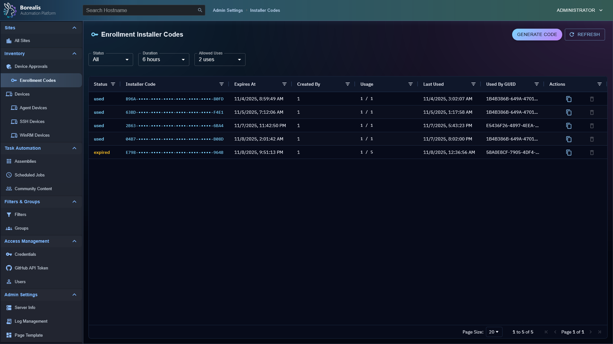
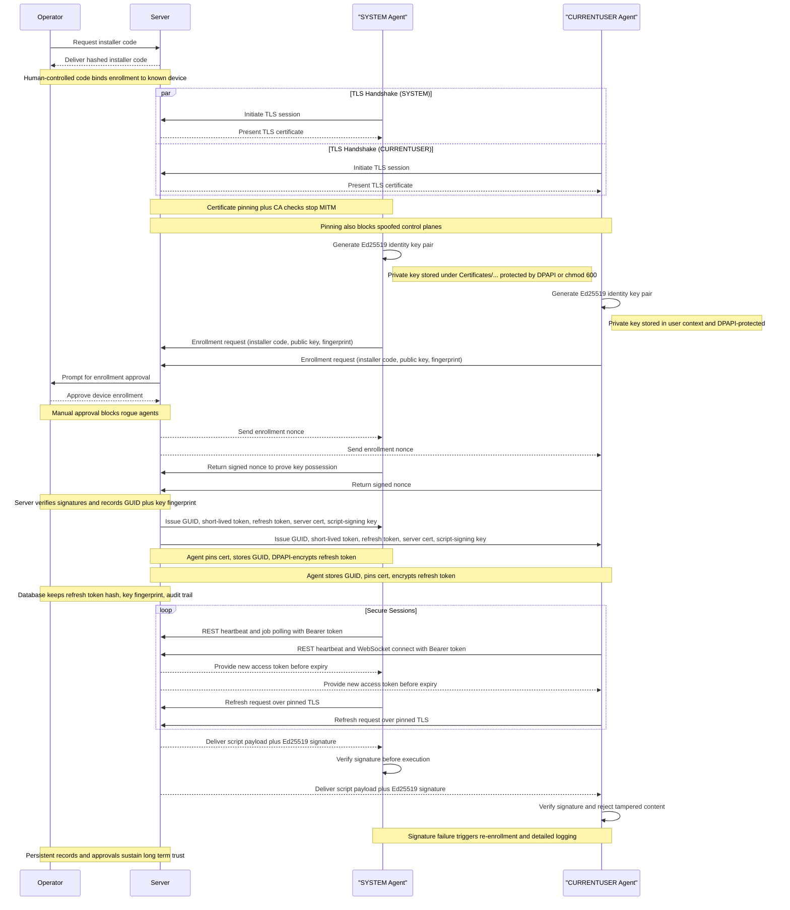
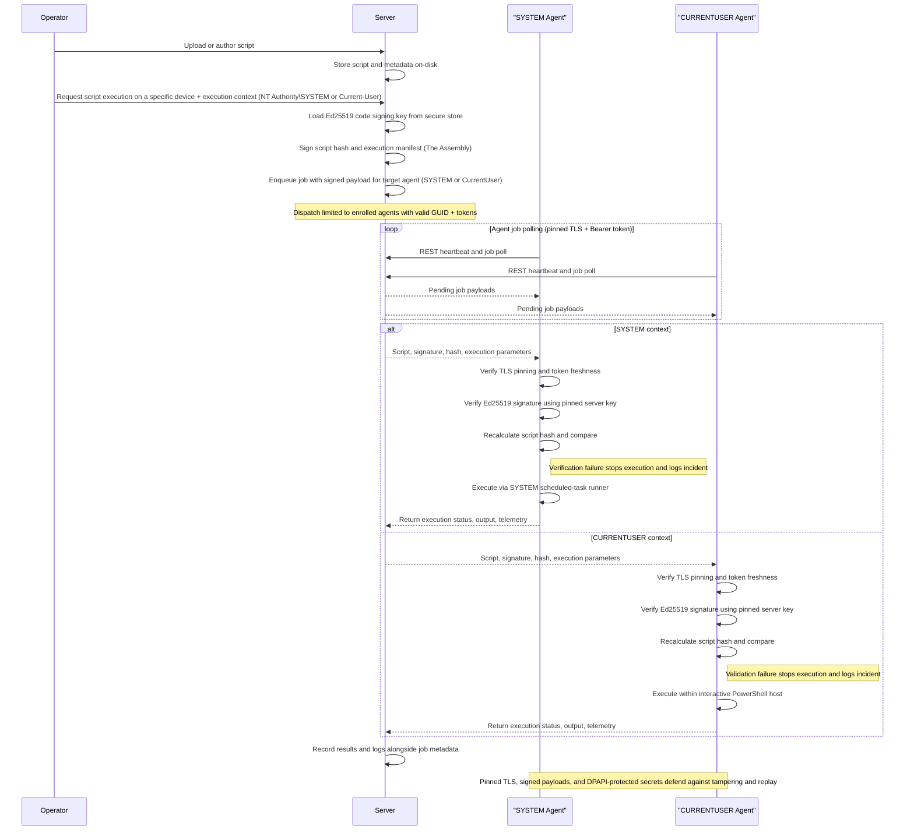

Borealis is a remote management platform with a simple, visual automation layer, enabling you to leverage scripts, Ansible playbooks, and advanced nodegraph-based automation workflows.  I originally created Borealis to work towards consolidating the core functionality of several standalone automation platforms in my homelab, such as TacticalRMM, Ansible AWX, SemaphoreUI, and a few others. 

---

## Features
- **Device Inventory**: OS, hardware, and status posted on connect and periodically.
- **Remote Script Execution**: Run PowerShell in `CURRENT USER` context or as `NT AUTHORITY\SYSTEM`.
- **Jobs and Scheduling**: Launch "*Quick Jobs*" instantly or create more advanced schedules.
- **Visual Workflows**: Drag‑and‑drop node canvas for combining steps, analysis, and logic.
- **Playbooks**: Run scripted procedures; ((*Ansible playbook support is in progress*)).
- **Windows‑first**. Linux server and agent deployment scripts are planned, as the core of Borealis is Python-based, it is already Linux-friendly; this just involves some housekeeping to bring the Linux experience to parity with Windows.  

## Device Management
Device List:


Device Details:


Device Approval Queue:


Device Enrollment Codes:


## Assembly Management
Assembly List:


Assembly Editor:


Workflow Editor:
[](https://www.youtube.com/watch?v=6GLolR70CTo)

# Log Management
PLACEHOLDER:


PLACEHOLDER:


## Misc Management Sections
Scheduled Job List:


Scheduled Job History:


Site List:


## Getting Started

### Installation
1) Start the Server:
   - Windows: `./Borealis.ps1 -Server -Flask` *Production Server @ http://localhost:5000*
   - Windows: `./Borealis.ps1 -Server -Vite` *Development Server @ http://localhost:5173*
2) (*Optional*) Install the Agent (*elevated PowerShell*):
   - Windows: `./Borealis.ps1 -Agent`

### Reverse Proxy Configuration
Traefik Dynamic Config: `Replace Service URL with actual IP of Borealis server`
```yml
http:
  routers:
    borealis:
      entryPoints:
        - websecure
      tls:
        certResolver: letsencrypt
      service: borealis
      rule: "Host(`borealis.example.com`) && PathPrefix(`/`)"
      middlewares:
        - cors-headers

  middlewares:
    cors-headers:
      headers:
        accessControlAllowOriginList:
          - "*"
        accessControlAllowMethods:
          - GET
          - POST
          - OPTIONS
        accessControlAllowHeaders:
          - Content-Type
          - Upgrade
          - Connection
        accessControlMaxAge: 100
        addVaryHeader: true

  services:
    borealis:
      loadBalancer:
        servers:
          - url: "http://127.0.0.1:5000"
        passHostHeader: true
```

## Security Breakdowns
The process that agents go through when authenticating securely with a Borealis server can be a little complex, so I have included a few sequence diagrams below along with a summary of the (current) security posture of Borealis to go over the core systems so you can visually understand what is going on behind-the-scenes.

### Security Overview
#### Overall
- Borealis enforces mutual trust: each agent presents a unique Ed25519 identity to the server, the server issues EdDSA-signed (Ed25519) access tokens bound to that fingerprint, and both sides pin the generated Borealis root CA.
- End-to-end TLS everywhere: the server ships an ECDSA P-384 root + leaf chain and only serves TLS 1.3; agents require TLS 1.2+ and "pin" (store the server certificate for future verification) the delivered bundle for both REST and WebSocket traffic, eliminating Man-in-the-middle avenues.
- Device enrollment is gated by enrollment/installer codes (*They have configurable expiration and usage limits*) and an operator approval queue; replay-resistant nonces plus rate limits (40 req/min/IP, 12 req/min/fingerprint) prevent brute force or code reuse.
- All device APIs now require Authorization: Bearer headers and a service-context (e.g. SYSTEM or CURRENTUSER) marker; missing, expired, mismatched, or revoked credentials are rejected before any business logic runs.  Operator-driven revoking / device quarantining logic is not yet implemented.
- Replay and credential theft defenses layer in DPoP proof validation (thumbprint binding) on the server side and short-lived access tokens (15 min) with 30-day refresh tokens hashed via SHA-256.
- Centralized logging under Logs/Server and Agent/Logs captures enrollment approvals, rate-limit hits, signature failures, and auth anomalies for post-incident review.
#### Server Security
- Auto-manages PKI: a persistent Borealis root CA (ECDSA SECP384R1) signs leaf certificates that include localhost SANs, tightened filesystem permissions, and a combined bundle for agent identity / cert pinning.
- Script delivery is code-signed with an Ed25519 key stored under Certificates/Server/Code-Signing; agents refuse any payload whose signature or hash does not match the pinned public key.
- Device authentication checks GUID normalization, SSL fingerprint matches, token version counters, and quarantine flags before admitting requests; missing rows with valid tokens auto-recover into placeholder records to avoid accidental lockouts.
- Refresh tokens are never stored in cleartext, only SHA-256 hashes plus DPoP bindings land in SQLite, and reuse after revocation/expiry returns explicit error codes.
- Enrollment workflow queues approvals, detects hostname/fingerprint conflicts, offers merge/overwrite options, and records auditor identities so trust decisions are traceable.
- Background jobs prune expired enrollment codes and refresh tokens, keeping the attack surface small without silently deleting active  credentials.
#### Agent
- Generates device-wide Ed25519 key pairs on first launch, storing them under Certificates/Agent/Identity/ with DPAPI protection on Windows (chmod 600 elsewhere) and persisting the server-issued GUID alongside.
- Stores refresh/access tokens encrypted (DPAPI) with companion metadata that pins them to the expected server certificate fingerprint; mismatches or refresh failures trigger a clean re-enrollment.
- Imports the server’s TLS bundle into a dedicated ssl.SSLContext, reuses it for the REST session, and injects it into the Socket.IO engine so WebSockets enjoy the same pinning and hostname checks.
- Treats every script payload as hostile until verified: only Ed25519 signatures from the server are accepted, missing/invalid signatures are logged and dropped, and the trusted signing key is updated only after successful verification between the agent and the server.
- Operates outbound-only; there are no listener ports, and every API/WebSocket call flows through AgentHttpClient.ensure_authenticated, forcing token refresh logic before retrying.
- Logs bootstrap, enrollment, token refresh, and signature events to daily-rotated files under Agent/Logs, giving operators visibility without leaking secrets outside the project root.

### Agent/Server Enrollment


### Code-Signed Remote Script Execution

