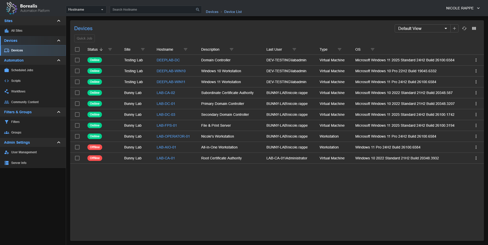
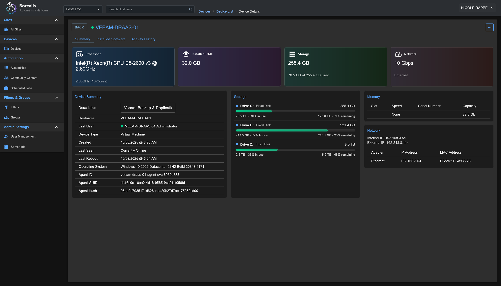
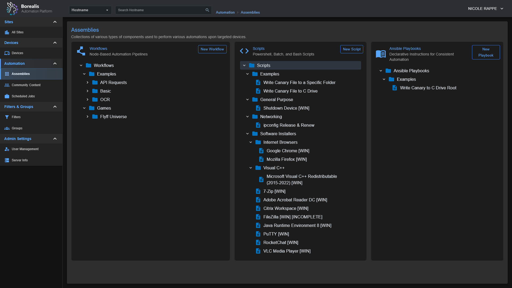
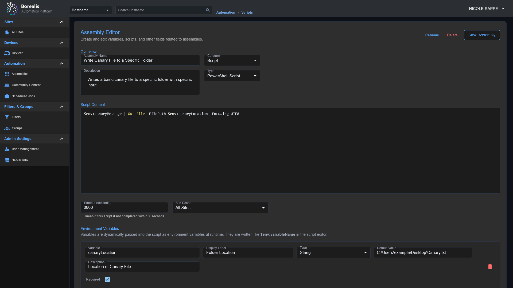
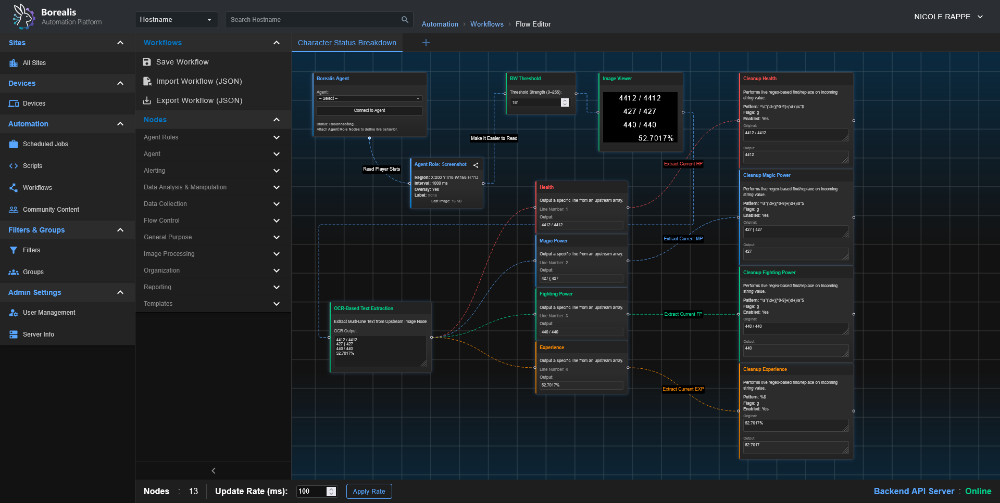

Borealis is a remote management platform with a simple, visual automation layer, enabling you to leverage scripts, Ansible playbooks, and advanced nodegraph-based automation workflows.  I originally created Borealis to work towards consolidating the core functionality of several standalone automation platforms in my homelab, such as TacticalRMM, Ansible AWX, SemaphoreUI, and a few others. 

⚠️**Security Note**: Server/Client/API authentication mechanisms are not yet enabled. For your own safety, use Borealis in controlled environments only.

---

## Features
- **Device Inventory**: OS, hardware, and status posted on connect and periodically.
- **Remote Script Execution**: Run PowerShell in `CURRENT USER` context or as `NT AUTHORITY\SYSTEM`.
- **Jobs and Scheduling**: Launch "*Quick Jobs*" instantly or create more advanced schedules.
- **Visual Workflows**: Drag‑and‑drop node canvas for combining steps, analysis, and logic.
- **Playbooks**: Run scripted procedures; ((*Ansible playbook support is in progress*)).
- **Windows‑first**. Linux server and agent deployment scripts are planned, as the core of Borealis is Python-based, it is already Linux-friendly; this just involves some housekeeping to bring the Linux experience to parity with Windows.  

## Screenshots
Device List Overview:


Device Details:


Assembly List & Editor:



[](https://www.youtube.com/watch?v=6GLolR70CTo)


## Getting Started

### Installation
1) Start the Server:
   - Windows: `./Borealis.ps1 -Server -Flask` *Production Server @ http://localhost:5000*
   - Windows: `./Borealis.ps1 -Server -Vite` *Development Server @ http://localhost:5173*
2) (*Optional*) Install the Agent (*elevated PowerShell*):
   - Windows: `./Borealis.ps1 -Agent`

### Reverse Proxy Configuration
Traefik Dynamic Config: `Replace Service URL with actual IP of Borealis server`
```yml
http:
  routers:
    borealis:
      entryPoints:
        - websecure
      tls:
        certResolver: letsencrypt
      service: borealis
      rule: "Host(`borealis.example.com`) && PathPrefix(`/`)"
      middlewares:
        - cors-headers

  middlewares:
    cors-headers:
      headers:
        accessControlAllowOriginList:
          - "*"
        accessControlAllowMethods:
          - GET
          - POST
          - OPTIONS
        accessControlAllowHeaders:
          - Content-Type
          - Upgrade
          - Connection
        accessControlMaxAge: 100
        addVaryHeader: true

  services:
    borealis:
      loadBalancer:
        servers:
          - url: "http://127.0.0.1:5000"
        passHostHeader: true
```