Borealis is a remote management platform with a simple, visual automation layer, enabling you to leverage scripts and advanced nodegraph-based automation workflows. I originally created Borealis to work towards consolidating the core functionality of several standalone automation platforms in my homelab, such as TacticalRMM, Ansible AWX, SemaphoreUI, and a few others. 

### A Note on Development Pace
I'm the sole maintainer and still learning as I go, while working a full-time IT job. Progress is sporadic, and parts of the codebase get rebuilt when I discover better or more optimized approaches. Thank you for your patience with the slower cadence.  Ko-Fi donations are always welcome and help keep me motivated to actively continue development of Borealis.

## Documentation
- Human-friendly docs live in `Docs/` with a top-level index at `Docs/index.md`.
- The same files also contain **Codex Agent** sections with deep, agent-focused implementation details.
- Start with `Docs/getting-started.md` and `Docs/architecture-overview.md`, then jump to the domain pages.

## Features
- **Device Inventory**: OS, hardware, and status posted on connect and periodically.
- **Remote Script Execution**: Run PowerShell in `CURRENT USER` context or as `NT AUTHORITY\SYSTEM`.
- **Jobs and Scheduling**: Launch "*Quick Jobs*" instantly or create more advanced schedules.
- **Visual Workflows**: Drag-and-drop node canvas for combining steps, analysis, and logic.
- **Ansible Playbooks**: Ansible playbook support is unfinished/broken in both the Engine and agent runtimes. The goal is to ship server-driven Ansible (SSH/WinRM) alongside agent-driven playbooks.
- **Linux Engine + Cross-Platform Agents**: Engine deployment is Linux-only (`Borealis.sh`), and agents run on both Windows (`Borealis.ps1`/`bootstrap.ps1` and Linux (`Borealis.sh`/`bootstrap.sh`).

## Current Status & Limitations
- Ansible is disabled/unstable: Engine quick-run returns not implemented, scheduled-job and agent paths are incomplete, and server-side SSH/WinRM playbook dispatch is still on the roadmap. Expect failures until the Ansible pipeline is rebuilt.
- Linux agents are functional, including enrollment and remote shell workflows.
- Remote bash script execution is not fully implemented or validated yet; treat Linux remote script execution as in-progress.

## Device Management
Device List:


Device Details:
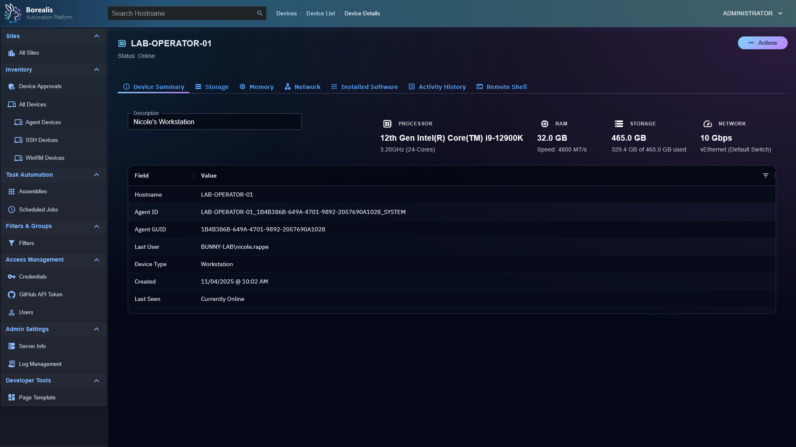

Device Remote Desktop:
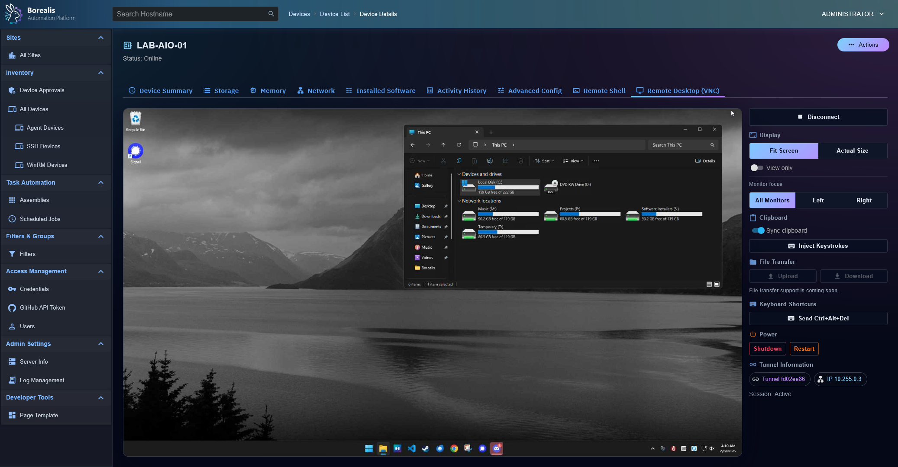

Device Approval Queue:
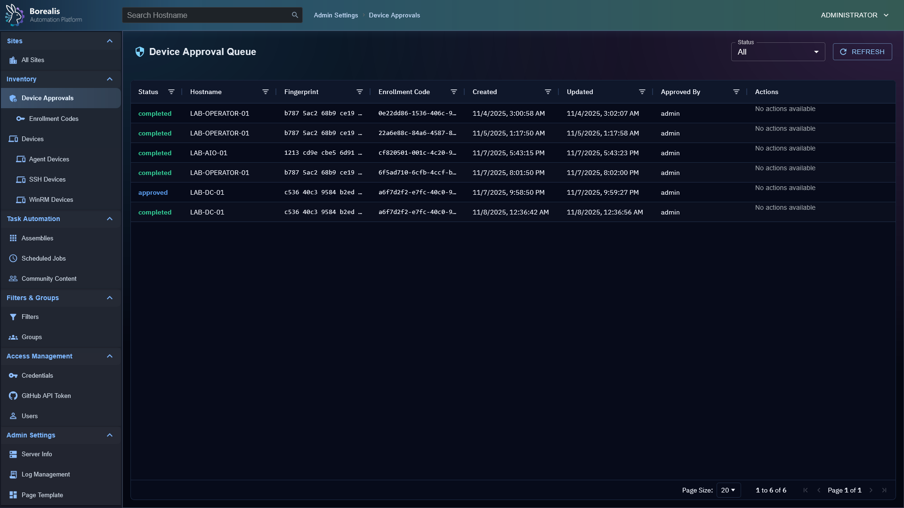

Device Filters:
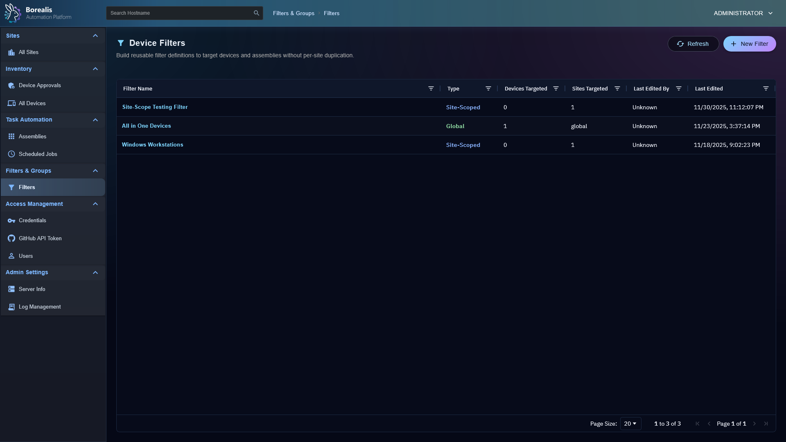

Device Filter Editor:
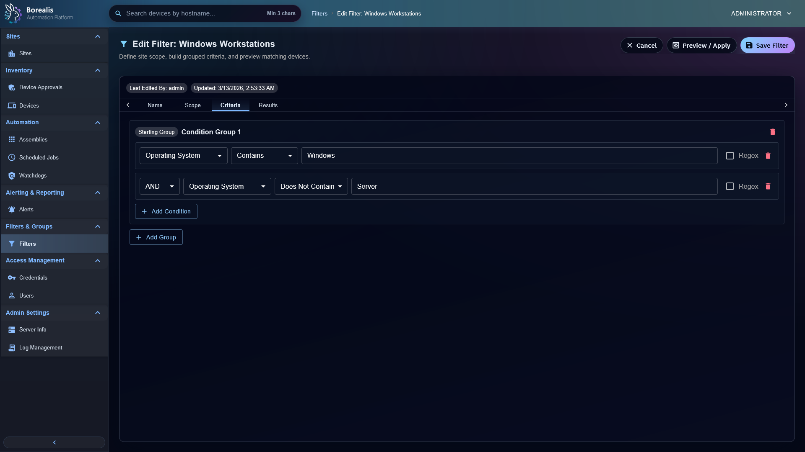

Device Remote Shell:


## Assembly Management
Assembly List:


Assembly Editor:
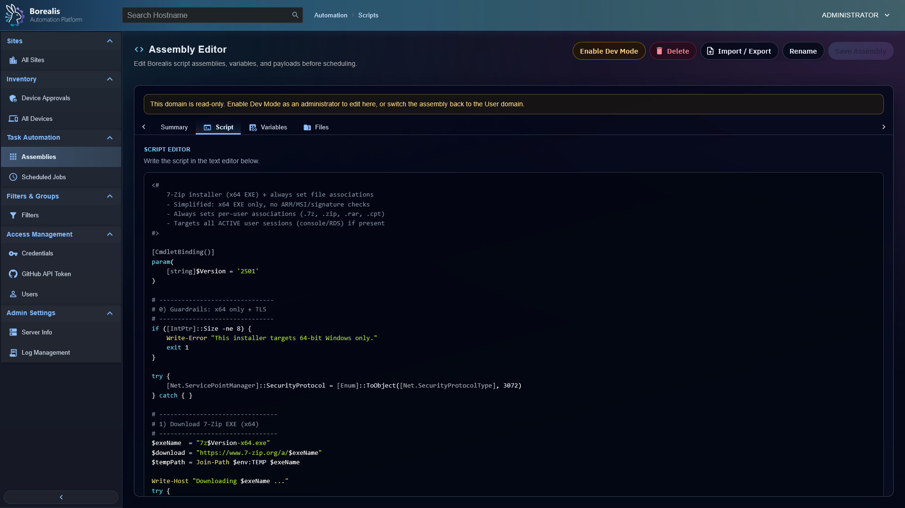

Workflow Editor:
[](https://www.youtube.com/watch?v=6GLolR70CTo)

## Log Management
Log Management:
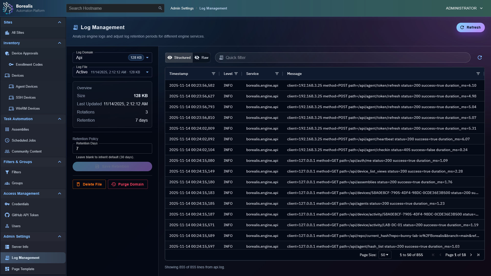

Log Management (Raw):


## Job Scheduling
Scheduled Job List:


Scheduled Job Editor:
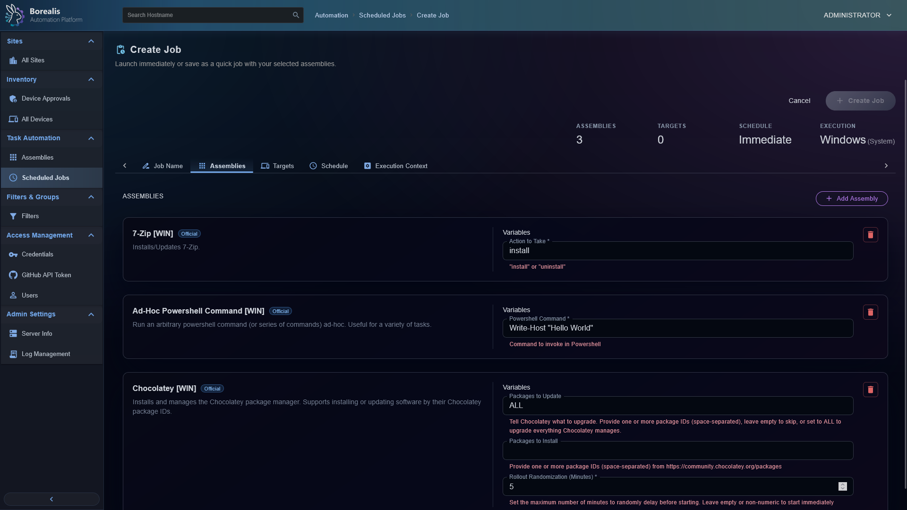

Scheduled Job History:
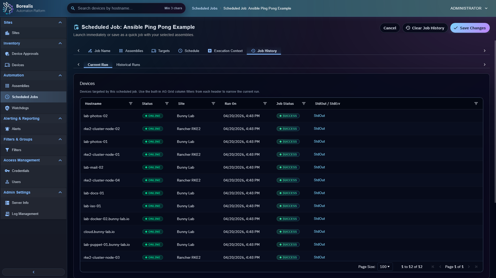

Ansible Playbook Recap:


## Misc Management

Site List:
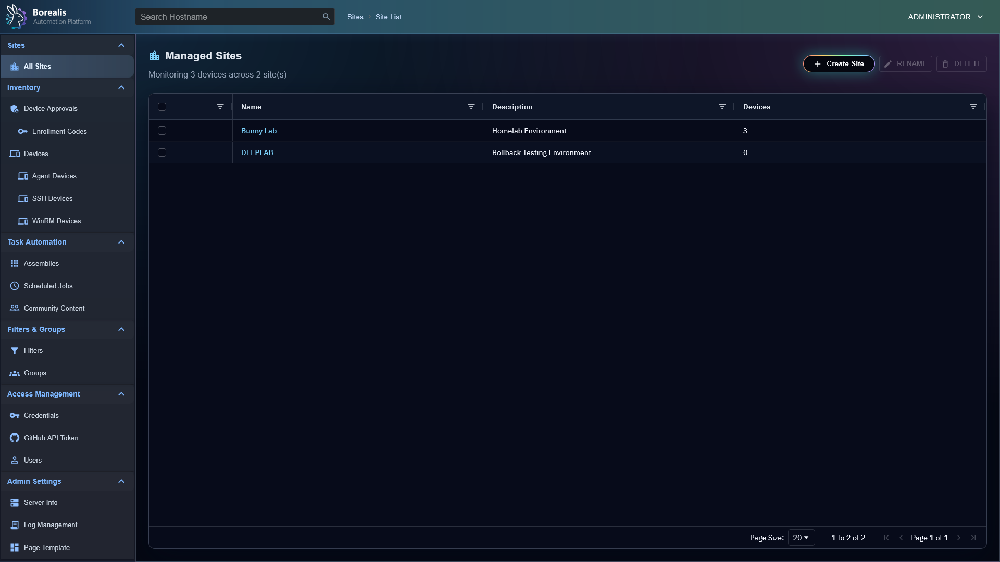

Credential Management List:
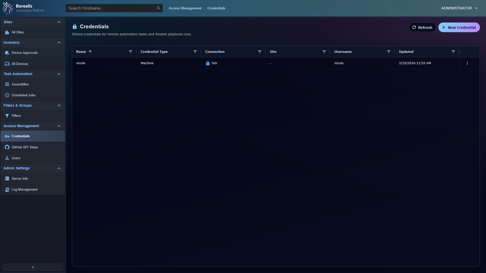

Credential Management Editor:


## Getting Started
### Engine Installation:
```sh
# Production
curl -fsSL https://raw.githubusercontent.com/bunny-lab-io/Borealis/refs/heads/main/bootstrap.sh | sudo bash -s -- --engine-production

# Development (Vite Dev File Hot-loading)
curl -fsSL https://raw.githubusercontent.com/bunny-lab-io/Borealis/refs/heads/main/bootstrap.sh | sudo bash -s -- --engine-dev
```
### Agent Installation:
#### Windows
```powershell
$env:BOREALIS_SERVER_URL="https://192.168.3.252:5000"; $env:BOREALIS_ENROLLMENT_CODE="044C-30BA-A742-8D8E-20FB-771A-A94F-E6E4"; irm https://raw.githubusercontent.com/bunny-lab-io/Borealis/refs/heads/main/bootstrap.ps1 | iex
```
#### Linux
```sh
curl -fsSL https://raw.githubusercontent.com/bunny-lab-io/Borealis/refs/heads/main/bootstrap.sh | sudo bash -s -- --agent --serverurl "https://192.168.3.252:5000" --enrollmentcode "044C-30BA-A742-8D8E-20FB-771A-A94F-E6E4"
```

