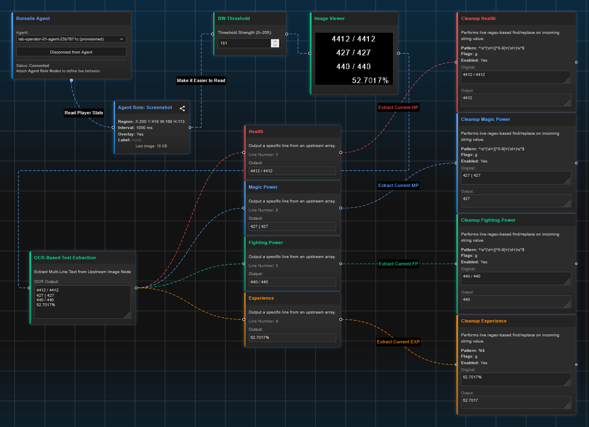

# Borealis: Visual Automation For Everyone

**Borealis** is an all-in-one visual automation studio.
Whether you want to automate data flows, control a computer, extract data from images, or connect to APIs and webhooks, Borealis turns these advanced tasks into a simple, visual drag-and-drop experience.

## Youtube Video Demonstration:
You can click the image below to watch a youtube video demonstrating the deployment, launching, and basic example usage of Borealis.
[](https://www.youtube.com/watch?v=6GLolR70CTo)

## 🚀 What Is Borealis?

Imagine building automations and powerful data workflows by *connecting blocks on a canvas* — and having them come to life in real time. Borealis is a cross-platform, live-editable automation tool that makes it possible to create, test, and run workflows with **zero coding required** (unless you want to).

Borealis combines:

* **A powerful visual graph editor** (built with React Flow)
* **A real-time backend server** (Python Flask + WebSockets)
* **Optional Python Agent** for advanced computer automation (screenshot, overlays, and more)
* **Live node updates, instant feedback, no restarts required**

---

## ✨ Key Features

| Feature                               | What It Means For You                                                                                                               |
| ------------------------------------- | ----------------------------------------------------------------------------------------------------------------------------------- |
| **Visual Editor**                     | Drag-and-drop nodes to build workflows just like drawing a flowchart                                                                |
| **Live Data Updates**                 | Every node reacts instantly as data changes, thanks to a shared “memory bus”                                                        |
| **No-Code and Low-Code Friendly**     | Start with zero code — but add custom nodes if you want power-user features                                                         |
| **Hot-Reloading, Developer-Friendly** | Add, edit, or even break nodes while Borealis is running. UI recovers, dev server restarts instantly — *no crashes, no frustration* |
| **Real-Time Computer Automation**     | Take screenshots, control keyboard, and send actions to your PC with the Borealis Agent                                             |
| **OCR & Computer Vision**             | Extract text from images and screenshots with Tesseract and EasyOCR, ready to flow into your automation                             |
| **Data Ingestion & Manipulation**     | Ingest data from files, APIs, manual input, or other sources — then filter, search, transform, or export it                         |
| **API Requests & Webhooks**           | Talk to REST APIs, integrate with web services, and hook Borealis into other tools                                                  |
| **Extensible Node Library**           | Add your own custom nodes or use the included library for data, images, math, logic, reporting, and more                            |
| **Undo & Resilience**                 | Made a mistake editing a node or the UI? No worries — just fix it and reload. Vite dev server makes changes appear instantly        |
| **Cross-Platform**                    | Works on Windows, Linux, macOS — one-click launch scripts included                                                                  |

---

## 🧰 What Can You Build With Borealis?

* **Data Pipelines:** Move data between files, APIs, spreadsheets, and apps
* **Automated Reports:** Process and transform information, then export to CSV
* **Image Analysis:** Use OCR nodes to read text from screenshots and images (great for extracting data from anything on screen)
* **Computer Automation:** Trigger keypresses, capture screens, and even run scheduled macros
* **APIs & Webhooks:** Build visual flows that connect to any REST API, fetch data, and process responses
* **Real-Time Dashboards:** Build custom, live-updating dashboards by wiring together data nodes and viewers
* **Rapid Prototyping:** Instantly test ideas — drop in new nodes, see your changes live, and never fear breaking things

---

## 🏆 Why Borealis Stands Out

* **Instant Feedback:** Every change is live. No need to restart — just drag, connect, or edit and see results instantly.
* **No Fear Development:** Messed up a node file? UI won’t crash; just fix the file, save, and Borealis will hot-reload it.
* **Beginner Friendly:** If you can use a mouse, you can use Borealis. But it grows with you as you learn.

---

## 🔭 Future Potential (What Borealis Could Become)

Borealis is already a swiss-army knife in the works — but here’s just a taste of what’s coming, or at-least possible, thanks to its modular, node-based design:

* **Smart Automation:** Automatically detect patterns, trigger workflows from email, websites, or events.
* **Machine Learning Nodes:** Drag-and-drop AI tasks — run models, analyze data, or classify images/text.
* **IoT & Device Integration:** Control or monitor physical devices, sensors, and smart home gadgets.
* **Advanced Scheduling:** Visual “when/if/then” automation, with scheduling, event triggers, and more.
* **Multi-User Collaboration:** Share, co-edit, or run workflows with others — team automation made simple.
* **Plug-in Marketplace:** Install new nodes and integrations from the community, just like adding apps.
* **Web Scraping & Automation:** Visual web scraping, browser automation, and data collection tools.
* **Full API/Webhook In/Out:** Integrate with Zapier, IFTTT, or any tool that speaks HTTP.

---

## 💡 How Borealis Works (In Plain English)

1. **You build a flow** by dragging “nodes” onto a canvas and connecting them.
2. **Each node** does something — like reading a file, fetching an API, or processing an image.
3. **Live data flows** through the graph in real time. Change a value? Every downstream node updates automatically.
4. **The shared “Value Bus”** means nodes always see the latest data. No refreshes needed.
5. **Power-users and developers** can add their own nodes, or tweak the UI, with changes appearing instantly — even if you make a mistake.

---

## 📈 Current Node Library (and Always Growing!)

* **Data Nodes:** Manual input, data passing, array extraction, JSON handling, etc.
* **Image Nodes:** Upload, preview, adjust contrast, grayscale, threshold, export, etc.
* **OCR Nodes:** Extract text from images/screenshots using Tesseract/EasyOCR.
* **Logic/Math Nodes:** Comparisons, math operations, logic gates, and more.
* **Agent Nodes:** Remote screenshot, macro keypress (*work-in-progress*), automation of foreground windows.
* **Reporting Nodes:** Export to CSV (*work-in-progress*) (future: other formats).
* **API/Web Nodes:** API requests, regex, text manipulation, etc.
* **Organization Nodes:** Grouping/backdrop for neat, readable graphs. (*work-in-progress*)

---

## 🤝 Who Is Borealis For?

* **Automation geeks** who want a real-time, visual playground
* **Data analysts** who want to prototype and visualize data flows
* **Developers** who want a safe, forgiving testbed for new ideas

---

## 🚦 Getting Started

1. **Download Borealis**
2. **Run the launcher:**

   * Windows: `Borealis.ps1`
   * Linux/macOS: `Borealis.sh`
3. **Open the web UI** in your browser. Start building!

---

## 🎁 Borealis Is Just Getting Started

Borealis is **more than a tool** — it’s a playground, a laboratory, and a future-proof platform for any automation you can imagine. Its best features are still ahead, and you can help shape them.

**Start automating your ideas, today.**

---

## ⚡Reverse Proxy Configuration
If you want to run Borealis behind a reverse proxy (e.g., Traefik), you can set up the following dynamic configuration:
```yml
http:
  routers:
    borealis:
      entryPoints:
        - websecure
      tls:
        certResolver: letsencrypt
      service: borealis
      rule: "Host(`borealis.bunny-lab.io`) && PathPrefix(`/`)"
      middlewares:
        - cors-headers

  middlewares:
    cors-headers:
      headers:
        accessControlAllowOriginList:
          - "*"
        accessControlAllowMethods:
          - GET
          - POST
          - OPTIONS
        accessControlAllowHeaders:
          - Content-Type
          - Upgrade
          - Connection
        accessControlMaxAge: 100
        addVaryHeader: true

  services:
    borealis:
      loadBalancer:
        servers:
          - url: "http://192.168.3.254:5173"
        passHostHeader: true
```
